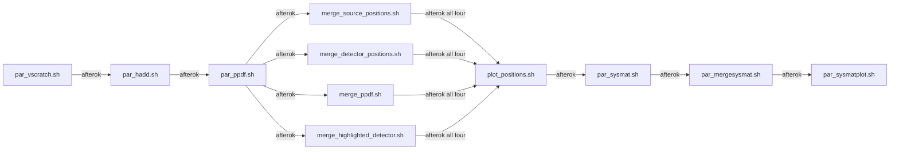

# Parallel GATE Simulation: End-to-End Technical Inspection

## 1. Executive Summary

This folder implements a parallel Monte Carlo workflow for a single-panel GATE simulation, ROOT post-processing, detector-conditioned PPDF generation, and a detector-loop "system matrix" export. The strongest current production entry point is `par_all.sh`, which submits a simulation array, merges per-run ROOT fragments, generates per-run parquet summaries, merges those summaries, and then generates detector-indexed heatmaps (`GateParallel_NewConfiguration/GATE-Macro/par_all.sh:4-27`).

The simulation itself is defined by `SPEBT.mac`, which loads custom materials, builds one `cylindricalPET` system with a single `panel/module/block/zlayer` hierarchy, places eight staggered crystal strips, initializes physics, digitizers, source, output, and then starts a 15 s DAQ (`GateParallel_NewConfiguration/GATE-Macro/SPEBT.mac:2-29`). The detector geometry contains 144 GAGG crystals total: seven strips repeated 16 times and one strip repeated 32 times (`GateParallel_NewConfiguration/GATE-Macro/geometry.mac:165-187`).

The code base is not a clean separation between generic framework and detector-specific configuration. Detector count `144`, hard-coded ID loops, absolute paths, assumed tree names, and fixed `volumeID[2] == 0` are embedded in multiple scripts (`GateParallel_NewConfiguration/GATE-Macro/generate_ppdf_with_detectors.py:20-50`, `GateParallel_NewConfiguration/GATE-Macro/generate_sysmat.py:24-25`, `GateParallel_NewConfiguration/GATE-Macro/par_sysmatplot.sh:37-48`).

Several issues must be resolved before implementing a new detector configuration:

- The active PPDF script computes a normalized source distribution only for detector ID 0, despite looping over 144 detector IDs only to collect highlight positions (`GateParallel_NewConfiguration/GATE-Macro/generate_ppdf_with_detectors.py:25-50`).
- Downstream event matching uses `eventID` only, while notebook evidence shows `runID` also exists in the trees; merged independent runs therefore have collision risk unless `runID` is incorporated (`GateParallel_NewConfiguration/GATE-Macro/generate_ppdf_with_detectors.py:54-77`, `GateParallel_NewConfiguration/GATE-Macro/generate_sysmat.py:27-39`, `GateParallel_NewConfiguration/GATE-Macro/.ipynb_checkpoints/MC PPDF-checkpoint.ipynb:23-24,75-76`).
- Simulation runs `0-100`, but the merge, PPDF, and system-matrix arrays run `1-100`, so task 0 is not processed downstream (`GateParallel_NewConfiguration/GATE-Macro/par_vscratch.sh:5`, `GateParallel_NewConfiguration/GATE-Macro/par_hadd.sh:5`, `GateParallel_NewConfiguration/GATE-Macro/par_ppdf.sh:4`, `GateParallel_NewConfiguration/GATE-Macro/par_sysmat.sh:4`).
- Physics is intentionally simplified to photoelectric absorption only, with Compton and Rayleigh commented out. That is suitable for a geometric sensitivity study, but not for realistic Tc-99m SPECT response (`GateParallel_NewConfiguration/GATE-Macro/physics.mac:5-28`).

## 2. Repository Scope

Primary inspection scope: all relevant files under `GateParallel_NewConfiguration/GATE-Macro`.

Secondary comparison scope: `GateParallel_OldConfiguration/GATE-Macro` only where needed for context. In this inspection, old-configuration files were not required to establish the current active execution path.

Out of scope: deep analysis of `NewConfiguration`, `OldConfiguration`, and `MPH` beyond dependencies directly referenced by the parallel implementation.

Method constraints followed:

- No simulation macros, scripts, or outputs were modified.
- No GATE production jobs or SLURM jobs were run.
- Only static inspection commands and safe notebook JSON inspection were used.

## 3. Complete File Inventory

| File | Type | Role | Called By | Calls/Includes | Active Status | Notes |
| ---- | ---- | ---- | --------- | -------------- | ------------- | ----- |
| `SPEBT.mac` | GATE macro | Main simulation entry macro | `par_vscratch.sh`, `par.sh`, `submit_simulation.sh`, `batch_par.sh` | `geometry.mac`, `plate.mac`, `system.mac`, `physics.mac`, `digitizer.mac`, `source.mac`, `verbose.mac`, `output.mac` | Active | Central macro (`GateParallel_NewConfiguration/GATE-Macro/SPEBT.mac:2-29`) |
| `geometry.mac` | GATE macro | World and detector hierarchy | `SPEBT.mac` | none | Active | Defines 144 crystals (`GateParallel_NewConfiguration/GATE-Macro/geometry.mac:20-187`) |
| `plate.mac` | GATE macro | Tungsten plate with repeated air holes | `SPEBT.mac` | none | Active | Daughter of `module` (`GateParallel_NewConfiguration/GATE-Macro/plate.mac:2-30`) |
| `system.mac` | GATE macro | System attachment and crystal SD registration | `SPEBT.mac` | none | Active | Uses `cylindricalPET` (`GateParallel_NewConfiguration/GATE-Macro/system.mac:2-28`) |
| `physics.mac` | GATE macro | Physics-process setup and cuts | `SPEBT.mac` | none | Active | Photoelectric only (`GateParallel_NewConfiguration/GATE-Macro/physics.mac:5-28`) |
| `digitizer.mac` | GATE macro | Eight Singles digitizer chains | `SPEBT.mac` | none | Active | One chain per xlayer (`GateParallel_NewConfiguration/GATE-Macro/digitizer.mac:4-122`) |
| `source.mac` | GATE macro | Gamma plane source | `SPEBT.mac` | none | Active | Rectangle plane at x=-187.5 mm (`GateParallel_NewConfiguration/GATE-Macro/source.mac:42-62`) |
| `output.mac` | GATE macro | ROOT tree output configuration | `SPEBT.mac` | none | Active | Writes `/vscratch/.../SPEBT_${SLURM_ARRAY_TASK_ID}.root` (`GateParallel_NewConfiguration/GATE-Macro/output.mac:14-17`) |
| `verbose.mac` | GATE macro | Verbosity suppression | `SPEBT.mac` | none | Active | All verbosity 0 (`GateParallel_NewConfiguration/GATE-Macro/verbose.mac:18-35`) |
| `visual.mac` | GATE macro | VRML visualization | Commented in `SPEBT.mac` | none | Potentially active | Not executed by current `SPEBT.mac` (`GateParallel_NewConfiguration/GATE-Macro/SPEBT.mac:10`) |
| `GateMaterials.db` | Material DB | Custom material definitions | `SPEBT.mac` via `/gate/geometry/setMaterialDatabase` | none | Active | Defines `GAGG`, `Tungsten`, `Air` (`GateParallel_NewConfiguration/GATE-Macro/GateMaterials.db:78-79,121-125,155-159`) |
| `par_all.sh` | Shell | Main multi-stage orchestration | Manual entry point | `par_vscratch.sh`, `par_hadd.sh`, `par_ppdf.sh`, merge scripts, `plot_positions.sh`, `par_sysmat.sh`, `par_mergesysmat.sh`, `par_sysmatplot.sh` | Active | Strongest current production pipeline (`GateParallel_NewConfiguration/GATE-Macro/par_all.sh:4-27`) |
| `par_vscratch.sh` | SLURM array | Simulation array launcher | `par_all.sh` | `Gate` on generated `SPEBT_run_*.mac` | Active | Simulation stage (`GateParallel_NewConfiguration/GATE-Macro/par_vscratch.sh:21-39`) |
| `par_hadd.sh` | SLURM array | ROOT merge stage per run index | `par_all.sh` | `hadd` | Active | Merges hits and singles separately (`GateParallel_NewConfiguration/GATE-Macro/par_hadd.sh:22-29`) |
| `par_ppdf.sh` | SLURM array | PPDF-generation array wrapper | `par_all.sh` | `ppdf.sh` | Active | One parquet generation task per merged run (`GateParallel_NewConfiguration/GATE-Macro/par_ppdf.sh:20-21`) |
| `ppdf.sh` | Shell/SLURM wrapper | Per-run PPDF generation | `par_ppdf.sh` | `generate_ppdf_with_detectors.py` | Active | Uses `hits${ID}.root` and `singles${ID}.root` (`GateParallel_NewConfiguration/GATE-Macro/ppdf.sh:20-25`) |
| `generate_ppdf_with_detectors.py` | Python | Active parquet PPDF generator | `ppdf.sh` | `uproot`, `pandas` | Active | Computes detector 0 only for PPDF, all 144 only for highlights (`GateParallel_NewConfiguration/GATE-Macro/generate_ppdf_with_detectors.py:20-97`) |
| `merge_source_positions.sh/.py` | SLURM/Python | Merge source-position parquet files | `par_all.sh`, `par_mergeplot.sh` | `glob`, `pandas` | Active | Concatenate + `drop_duplicates` (`GateParallel_NewConfiguration/GATE-Macro/merge_source_positions.py:4-21`) |
| `merge_detector_positions.sh/.py` | SLURM/Python | Merge detector-position parquet files | `par_all.sh`, `par_mergeplot.sh` | `glob`, `pandas` | Active | Concatenate + `drop_duplicates` (`GateParallel_NewConfiguration/GATE-Macro/merge_detector_positions.py:4-21`) |
| `merge_ppdf.sh/.py` | SLURM/Python | Merge PPDF parquet files | `par_all.sh`, `par_mergeplot.sh` | `glob`, `pandas` | Active | Concatenate + `drop_duplicates`, no aggregation (`GateParallel_NewConfiguration/GATE-Macro/merge_ppdf.py:4-21`) |
| `merge_highlighted_detector.sh/.py` | SLURM/Python | Merge highlighted-detector parquet files | `par_all.sh`, `par_mergeplot.sh` | `glob`, `pandas` | Active | Concatenate + `drop_duplicates` (`GateParallel_NewConfiguration/GATE-Macro/merge_highlighted_detector.py:4-21`) |
| `plot_positions.sh/.py` | SLURM/Python | Plot merged source/detector/PPDF positions | `par_all.sh`, `par_mergeplot.sh` | `matplotlib`, parquet files | Active | Plots highlighted detector 0 only (`GateParallel_NewConfiguration/GATE-Macro/plot_positions.py:5-45`) |
| `par_sysmat.sh` | SLURM array | System-matrix generation wrapper | `par_all.sh` | `sysmat.sh` | Active | One task per merged run (`GateParallel_NewConfiguration/GATE-Macro/par_sysmat.sh:23-24`) |
| `sysmat.sh` | Shell/SLURM wrapper | Per-run system-matrix generation | `par_sysmat.sh` | `generate_sysmat.py` | Active | Uses `hits${ID}.root` / `singles${ID}.root` (`GateParallel_NewConfiguration/GATE-Macro/sysmat.sh:17-22`) |
| `generate_sysmat.py` | Python | Detector-loop system-matrix export | `sysmat.sh` | `uproot`, `pandas` | Active | Loops `detector_id in range(144)` (`GateParallel_NewConfiguration/GATE-Macro/generate_sysmat.py:24-52`) |
| `par_mergesysmat.sh` | SLURM/Python inline | Merge per-run system matrices | `par_all.sh` | `glob`, `pandas` | Active | Pure concatenation, no count aggregation (`GateParallel_NewConfiguration/GATE-Macro/par_mergesysmat.sh:35-53`) |
| `par_sysmatplot.sh` | SLURM array + inline Python | Detector heatmaps from combined system matrix | `par_all.sh` | `numpy`, `pandas`, `matplotlib` | Active | Re-histograms rows into 200x200 bins (`GateParallel_NewConfiguration/GATE-Macro/par_sysmatplot.sh:37-112`) |
| `par_sysmatplotbinned.sh` | SLURM array + inline Python | Alternate binned heatmap plotter | Not referenced by active chain | inline Python | Experimental | Similar to `par_sysmatplot.sh`, different paths/bins (`GateParallel_NewConfiguration/GATE-Macro/par_sysmatplotbinned.sh:37-95`) |
| `par_sysmatplotconsist.sh` | SLURM array + inline Python | Alternate circular-masked heatmap plotter | Not referenced by active chain | inline Python | Experimental | Adds circular mask and fixed axes (`GateParallel_NewConfiguration/GATE-Macro/par_sysmatplotconsist.sh:37-113`) |
| `par_sysmatbin.sh` | SLURM + inline Python | Dense `.npy` matrix construction from one parquet file | Not referenced by active chain | inline Python | Experimental | Hard-coded `system_matrix_hits95.parquet` (`GateParallel_NewConfiguration/GATE-Macro/par_sysmatbin.sh:30-109`) |
| `par_mergeplot.sh` | Shell | Merge-and-plot subset pipeline | Manual entry point | merge scripts, `plot_positions.sh` | Auxiliary | Useful after PPDF stage only (`GateParallel_NewConfiguration/GATE-Macro/par_mergeplot.sh:6-13`) |
| `par.sh` | SLURM array | Older local-path simulation launcher | Manual | `Gate` on generated local macros | Legacy but runnable | Similar to `par_vscratch.sh` without vscratch copies (`GateParallel_NewConfiguration/GATE-Macro/par.sh:23-39`) |
| `submit_simulation.sh` | SLURM array | Older simulation launcher | Manual | `Gate` on generated local macros | Legacy/stale path | Uses old `parallel/SPEBT` path (`GateParallel_NewConfiguration/GATE-Macro/submit_simulation.sh:18-34`) |
| `batch_par.sh` | SLURM array | Older simulate-and-merge-in-one-job script | Manual | `Gate`, `hadd`, `rm -f` | Legacy and destructive | Deletes intermediates after merge (`GateParallel_NewConfiguration/GATE-Macro/batch_par.sh:37-71`) |
| `gate_parallel.slurm` | SLURM multi-node | Older non-array parallel strategy | Manual | `sed`, `srun Gate`, `hadd` | Experimental/stale | Template placeholders do not match current `SPEBT.mac` (`GateParallel_NewConfiguration/GATE-Macro/gate_parallel.slurm:39-69`) |
| `generate_ppdf.py` | Python | Older CSV single-detector PPDF generator | Not referenced by active chain | `uproot`, `pandas` | Legacy | Hard-codes detector 115 and `selected_volumeID_2=3` (`GateParallel_NewConfiguration/GATE-Macro/generate_ppdf.py:14-38`) |
| `merge_and_plot.py` | Python | Older CSV merge/plot path | Not referenced by active chain | `glob`, `pandas`, `matplotlib` | Legacy | CSV analogue of parquet path (`GateParallel_NewConfiguration/GATE-Macro/merge_and_plot.py:14-57`) |
| `get_all_ppdfs_mpi_optimized.py` | Python | Separate analytical MPI pipeline | Not referenced in primary workflow | `h5py`, `numpy`, `pymatcal`, `mpi4py`, `local_functions` | Out-of-pipeline | Depends on modules not present in this folder (`GateParallel_NewConfiguration/GATE-Macro/get_all_ppdfs_mpi_optimized.py:1-112`) |
| `sysmat_generation.ipynb` | Notebook | Exploratory matrix/plot analysis | Manual | pandas/matplotlib/yaml/h5py | Exploratory | Uses CSV-era workflow (`GateParallel_NewConfiguration/GATE-Macro/sysmat_generation.ipynb:14-32`) |
| `.ipynb_checkpoints/MC PPDF-checkpoint.ipynb` | Notebook checkpoint | Exploratory ROOT schema inspection and detector filtering | Manual | uproot/pandas | Exploratory but evidentiary | Confirms branches `runID`, `eventID`, `volumeID[2]`, `volumeID[6]`, `sourcePosX`, `sourcePosY` (`GateParallel_NewConfiguration/GATE-Macro/.ipynb_checkpoints/MC PPDF-checkpoint.ipynb:23-24,46-55,75-79,2101-2109`) |
| Empty `.out/.err` files | Log files | Job remnants | none | none | Inactive | No useful content in inspected worktree |
| `slurm-18152943.out` | Log file | Submission log | none | none | Historical evidence | Shows `Submitted batch job 18154502` only (`GateParallel_NewConfiguration/GATE-Macro/slurm-18152943.out:1`) |

## 4. Active Entry Points

### Primary production entry point

`bash par_all.sh` from `GateParallel_NewConfiguration/GATE-Macro`.

Confirmed from code:

- It submits simulation first: `par_vscratch.sh` (`GateParallel_NewConfiguration/GATE-Macro/par_all.sh:4`).
- It then submits dependent merge, PPDF, merge-PPDF, plot, system-matrix, merged-system-matrix, and per-detector plot stages (`GateParallel_NewConfiguration/GATE-Macro/par_all.sh:7-27`).

Expected environment:

- SLURM cluster with `sbatch`.
- CCR-style modules for `gcc`, `geant4`, `gate`, `openmpi`, `matplotlib` (`GateParallel_NewConfiguration/GATE-Macro/par_vscratch.sh:16-19`, `GateParallel_NewConfiguration/GATE-Macro/plot_positions.sh:15-18`).
- Write access to `/vscratch/grp-rutaoyao/Tridev`.

### Auxiliary entry points

- `bash par_mergeplot.sh`: merge already-generated PPDF outputs and plot them (`GateParallel_NewConfiguration/GATE-Macro/par_mergeplot.sh:6-13`).
- `sbatch par.sh`: direct array simulation in place, older variant (`GateParallel_NewConfiguration/GATE-Macro/par.sh:1-39`).
- `sbatch submit_simulation.sh`: older path-specific launcher (`GateParallel_NewConfiguration/GATE-Macro/submit_simulation.sh:1-34`).
- `sbatch gate_parallel.slurm`: older multi-node non-array strategy using generated macros and background `srun` (`GateParallel_NewConfiguration/GATE-Macro/gate_parallel.slurm:37-75`).

### Real downstream products

- Simulation ROOT fragments in `/vscratch/grp-rutaoyao/Tridev`.
- Per-run merged `hits*.root` and `singles*.root` (`GateParallel_NewConfiguration/GATE-Macro/par_hadd.sh:27-29`).
- Per-run parquet PPDF and detector/source position files (`GateParallel_NewConfiguration/GATE-Macro/generate_ppdf_with_detectors.py:81-97`).
- Per-run parquet system matrices (`GateParallel_NewConfiguration/GATE-Macro/generate_sysmat.py:52-54`).
- Merged parquet summaries and per-detector PNG heatmaps (`GateParallel_NewConfiguration/GATE-Macro/par_mergesysmat.sh:52-53`, `GateParallel_NewConfiguration/GATE-Macro/par_sysmatplot.sh:107-112`).

## 5. End-to-End Execution Graph

### High-level workflow

```mermaid
flowchart TD
    A[par_all.sh] --> B[par_vscratch.sh array 0-100]
    B --> C[Gate on generated SPEBT_run_ID.mac]
    C --> D[/vscratch/.../SPEBT_ID.root and GATE tree fragments]
    D --> E[par_hadd.sh array 1-100]
    E --> F[hitsID.root and singlesID.root]
    F --> G[par_ppdf.sh array 1-100]
    G --> H[generate_ppdf_with_detectors.py]
    H --> I[ppdf_hitsID.parquet + source/detector/highlight parquet]
    I --> J[merge_* scripts]
    J --> K[plot_positions.py]
    F --> L[par_sysmat.sh array 1-100]
    L --> M[generate_sysmat.py]
    M --> N[system_matrix_hitsID.parquet]
    N --> O[par_mergesysmat.sh]
    O --> P[combined_system_matrix.parquet]
    P --> Q[par_sysmatplot.sh array 0-143]
```

Evidence:

- Orchestration edges from `par_all.sh:4-27`.
- Simulation edge from `par_vscratch.sh:30-39`.
- ROOT merge edge from `par_hadd.sh:27-29`.
- PPDF stage edge from `ppdf.sh:21-25`.
- System-matrix stage edge from `sysmat.sh:17-22`.

### SLURM dependency graph



Confirmed from code: `GateParallel_NewConfiguration/GATE-Macro/par_all.sh:4-27`.

### Data-flow notes

- Simulation emits ROOT trees.
- PPDF scripts read tree `tree;1` from merged hits and singles files (`GateParallel_NewConfiguration/GATE-Macro/generate_ppdf_with_detectors.py:10-13`).
- System-matrix scripts read the same ROOT schema (`GateParallel_NewConfiguration/GATE-Macro/generate_sysmat.py:10-15`).
- Merge scripts concatenate parquet outputs using file globs (`GateParallel_NewConfiguration/GATE-Macro/merge_ppdf.py:8-21`, `GateParallel_NewConfiguration/GATE-Macro/par_mergesysmat.sh:35-53`).

## 6. GATE Macro Execution Order

### Main macro order

`SPEBT.mac` executes in this exact order:

1. Set material database (`SPEBT.mac:2`).
2. Execute geometry macro (`SPEBT.mac:5`).
3. Execute collimator/plate macro (`SPEBT.mac:6`).
4. Execute system attachment macro (`SPEBT.mac:7`).
5. Execute physics macro (`SPEBT.mac:8`).
6. Initialize GATE (`SPEBT.mac:12`).
7. Execute digitizer macro (`SPEBT.mac:15`).
8. Execute source macro (`SPEBT.mac:16`).
9. Set random engine (`SPEBT.mac:19-20`).
10. Set acquisition start/stop times (`SPEBT.mac:22-23`).
11. Execute verbose and output macros (`SPEBT.mac:26-27`).
12. Start DAQ (`SPEBT.mac:29`).

Why this order matters:

- Materials must exist before any volume references them (`SPEBT.mac:2`, `geometry.mac:17,26,35,44,53,57-127`, `plate.mac:14,25`).
- Geometry must exist before system attachment and sensitive detector registration (`geometry.mac:20-187`, `system.mac:4-25`).
- System attachment and physics must exist before `/gate/run/initialize` (`SPEBT.mac:7-12`).
- Digitizers are configured after initialization, following the current macro authoring convention (`SPEBT.mac:12-16`, `digitizer.mac:4-122`).
- Source, acquisition timing, and output are defined before `/gate/application/startDAQ` (`SPEBT.mac:15-29`).

Interpretation of key commands:

- `/control/execute`: inline include of another macro, used as the only composition mechanism in `SPEBT.mac` (`SPEBT.mac:5-8,15-16,26-27`).
- `/gate/run/initialize`: build and validate geometry/physics before event generation (`SPEBT.mac:12`).
- `/gate/application/startDAQ`: begin event generation using the configured source, timing, digitizers, and outputs (`SPEBT.mac:29`).

Detector-geometry changes will directly affect at least `geometry.mac`, `plate.mac`, `system.mac`, `digitizer.mac`, and downstream ID assumptions in Python.

## 7. Coordinate-System Reference

### Coordinate-System Reference

Confirmed from code:

- Source plane center is at `(-187.5, 0, 0) mm` (`GateParallel_NewConfiguration/GATE-Macro/source.mac:50`).
- Detector panel center is at `(137, 0, 0) mm` (`GateParallel_NewConfiguration/GATE-Macro/geometry.mac:25`).
- Plate center is at local `(-44, 0, 0) mm` inside `module` (`GateParallel_NewConfiguration/GATE-Macro/plate.mac:6`).

Therefore, inferred global interpretation:

- `+x` points from source toward detector.
- `y` spans the long detector direction containing the staggered crystal rows.
- `z` spans the 20 mm detector thickness/secondary in-plane depth of the panel and the plate hole repetition.

ASCII sketch, inferred from placements:

```text
source plane at x = -187.5 mm
        |
        |  photons travel mainly toward +x
        v
 [world origin near cylindricalPET center]
        |
        +---- panel/module/block/zlayer centered near x = +137 mm
                |
                +---- crystals translated in local x and repeated in local y
                +---- tungsten plate translated toward negative local x
```

Reference frames:

- `panel` translation is relative to `cylindricalPET` (`geometry.mac:20-27`).
- `module` is relative to `panel` (`geometry.mac:29-36`).
- `block` is relative to `module` (`geometry.mac:38-45`).
- `zlayer` is relative to `block` (`geometry.mac:47-54`).
- `xlayer1..8` translations are relative to `zlayer` (`geometry.mac:132-139`).
- Repeater vectors are local to their repeated volumes (`geometry.mac:165-187`, `plate.mac:18-24`).

Units used:

- Length: `mm`, `cm` (`geometry.mac`, `plate.mac`, `physics.mac`).
- Energy: `keV` (`source.mac:48`, `digitizer.mac:17,31,...`, `physics.mac` cuts are length-based).
- Time: `s` (`SPEBT.mac:22-23`).
- Activity: `Ci` (`source.mac:49`).
- Angle: `deg` (`source.mac:59-61`).

## 8. Materials

Relevant custom materials:

| Material | Definition | Use | Evidence |
| ---- | ---- | ---- | ---- |
| `Tungsten` | `d=19.3 g/cm3 ; n=1` | `MetalPlate` collimator body | `GateMaterials.db:78-79`, `plate.mac:25` |
| `GAGG` | `d=6.63 g/cm3 ; n=4` with `Gd 3`, `Al 2`, `Ga 3`, `O 12` | All eight crystal strip volumes | `GateMaterials.db:121-125`, `geometry.mac:57-127` |
| `Air` | `d=1.29 mg/cm3` with N/O/Ar/C fractions | World daughter cylinder, panel/module/block/zlayer, plate holes | `GateMaterials.db:155-159`, `geometry.mac:17,26,35,44,53`, `plate.mac:14` |

Observed material usage:

- Detector scintillator: `GAGG`.
- Collimator/plate: `Tungsten`.
- Internal support/void hierarchy: `Air`.
- No additional detector support solids are explicitly modeled in the current macro set.

## 9. Geometry Hierarchy

Confirmed hierarchy from macros:

```text
world
└── cylindricalPET (Tubs, Air)
    └── panel (Box, Air)
        └── module (Box, Air)
            ├── block (Box, Air)
            │   └── zlayer (Box, Air)
            │       ├── xlayer1 (Box, GAGG) repeated 16
            │       ├── xlayer2 (Box, GAGG) repeated 16
            │       ├── xlayer3 (Box, GAGG) repeated 16
            │       ├── xlayer4 (Box, GAGG) repeated 16
            │       ├── xlayer5 (Box, GAGG) repeated 16
            │       ├── xlayer6 (Box, GAGG) repeated 16
            │       ├── xlayer7 (Box, GAGG) repeated 16
            │       └── xlayer8 (Box, GAGG) repeated 32
            └── MetalPlate (Box, Tungsten)
                └── hole (Box, Air) repeated 1×11×10
```

Evidence: `GateParallel_NewConfiguration/GATE-Macro/geometry.mac:9-187`, `GateParallel_NewConfiguration/GATE-Macro/plate.mac:2-30`.

Volume summary:

| Volume | Shape | Material | Size | Mother | Role |
| ---- | ---- | ---- | ---- | ---- | ---- |
| `cylindricalPET` | Tubs | Air | Rmin 100, Rmax 150, height 200 mm | `world` | Scanner container |
| `panel` | Box | Air | 100×108×20 mm | `cylindricalPET` | Detector housing level |
| `module` | Box | Air | 97×108×20 mm | `panel` | Module level and plate mother |
| `block` | Box | Air | 27×108×20 mm | `module` | Submodule level |
| `zlayer` | Box | Air | 27×108×3 mm | `block` | Crystal mother attached as system crystal |
| `xlayer1..8` | Box | GAGG | 3×3×3 mm each | `zlayer` | Sensitive scintillator elements |
| `MetalPlate` | Box | Tungsten | 2×107.52×20 mm | `module` | Collimator plate |
| `hole` | Box | Air | 2×2×2 mm | `MetalPlate` | Aperture cell |

The hierarchy is partly structural and partly driven by GATE system attachment. `panel/module/block/zlayer` correspond to `rsector/module/submodule/crystal` attachment levels in `system.mac` (`GateParallel_NewConfiguration/GATE-Macro/system.mac:4-14`).

## 10. Detector Configuration

### Crystal layout

Each crystal volume has size `3 × 3 × 3 mm` (`GateParallel_NewConfiguration/GATE-Macro/geometry.mac:56-128`). Local x translations inside `zlayer` form eight strips:

| Detector group | Local position `(x,y,z)` mm | Number of repeats | Pitch | Offset logic | Number of detector elements |
| ---- | ----: | ----: | ----: | ----: | ----: |
| `xlayer1` | `(-12, 0.18, 0)` | 16 | `(0, 6.72, 0)` | base row | 16 |
| `xlayer2` | `(-9, 0.81, 0)` | 16 | `(0, 6.72, 0)` | +0.63 mm y shift | 16 |
| `xlayer3` | `(-6, -0.45, 0)` | 16 | `(0, 6.72, 0)` | -0.63 mm shift from row1 | 16 |
| `xlayer4` | `(-3, 1.23, 0)` | 16 | `(0, 6.72, 0)` | +1.05 mm | 16 |
| `xlayer5` | `(0, -0.87, 0)` | 16 | `(0, 6.72, 0)` | -1.05 mm | 16 |
| `xlayer6` | `(3, 1.65, 0)` | 16 | `(0, 6.72, 0)` | +1.47 mm | 16 |
| `xlayer7` | `(6, -1.29, 0)` | 16 | `(0, 6.72, 0)` | -1.47 mm | 16 |
| `xlayer8` | `(9, 0.18, 0)` | 32 | `(0, 3.36, 0)` | twice the y sampling density | 32 |

Evidence: `GateParallel_NewConfiguration/GATE-Macro/geometry.mac:132-139,165-187`.

### Detector count derivation

Confirmed from code:

```text
Ndet = 7*16 + 1*32 = 112 + 32 = 144
```

No higher-level repeats multiply this count, because `panel`, `module`, `block`, and `zlayer` are each repeated once (`GateParallel_NewConfiguration/GATE-Macro/geometry.mac:160-163`).

### Design logic

Confirmed from code:

- Crystal x positions advance in 3 mm steps from `-12` to `+9` mm.
- y offsets alternate positive and negative sub-pitch shifts.
- `xlayer8` has half the y pitch of the other rows.

Inferred from code:

- The layout is intentionally staggered to provide sub-crystal sampling diversity along y.
- The geometry is not a simple rectangular 12×12 lattice.
- Detector ID ordering cannot be assumed from visual left-to-right or bottom-to-top intuition; downstream code relies on `volumeID[6]`, not on computed crystal centers.

Requires runtime validation:

- Whether `volumeID[6]` increments in y-first, x-first, or system-level order.
- Whether the `xlayer8` 32 repeats interleave in ID order with the other strips or remain grouped.

## 11. Detector Indexing and ID Mapping

Confirmed from code:

- Hits-side scripts read `volumeID[2]`, `volumeID[6]`, and `eventID` (`GateParallel_NewConfiguration/GATE-Macro/generate_ppdf_with_detectors.py:10-13`, `GateParallel_NewConfiguration/GATE-Macro/generate_sysmat.py:10-15`).
- Singles-side scripts read `sourcePosX`, `sourcePosY`, `sourcePosZ`, and `eventID` (`GateParallel_NewConfiguration/GATE-Macro/generate_ppdf_with_detectors.py:12-13`, `GateParallel_NewConfiguration/GATE-Macro/generate_sysmat.py:13-15`).
- Notebook checkpoint confirms tree branches include `runID`, `eventID`, `volumeID[2]`, `volumeID[6]`, `sourcePosX`, and `sourcePosY` (`GateParallel_NewConfiguration/GATE-Macro/.ipynb_checkpoints/MC PPDF-checkpoint.ipynb:23-24,46-55,75-79,2101-2109`).
- Active Python assumes `volumeID[2] == 0` and detector IDs `0..143` are the relevant detector loop (`GateParallel_NewConfiguration/GATE-Macro/generate_ppdf_with_detectors.py:20-26`, `GateParallel_NewConfiguration/GATE-Macro/generate_sysmat.py:24-25`).

What is known:

| Detector ID range | Geometry volume | Row/layer | Expected physical position | ROOT field | Python interpretation |
| ---- | ---- | ---- | ---- | ---- | ---- |
| `0..143` | Not proven beyond the sensitive crystal hierarchy | Not proven | One of the 144 crystal copies | `volumeID[6]` | Detector index loop |
| constant `0` | Not proven | Not proven | Higher-level attached volume ID | `volumeID[2]` | Filter gate; all active scripts keep only 0 |

Important caveat:

- The repository does not prove the semantic meaning of `volumeID[2]` and `volumeID[6]` from static code alone.
- Because `system.mac` attaches `zlayer` as `crystal`, while crystal sensitive detectors are attached to `xlayer1..8`, the branch-to-geometry mapping is only partially inferable from current files (`GateParallel_NewConfiguration/GATE-Macro/system.mac:4-25`).

Detector position handling in Python:

- `generate_ppdf_with_detectors.py` uses the first observed hit position for each `volumeID[6]` as the detector position summary (`GateParallel_NewConfiguration/GATE-Macro/generate_ppdf_with_detectors.py:27-48`).
- This is not a geometry-center computation; it is a first-hit proxy and therefore depends on observed interactions.

Implication:

- A new detector configuration must not rely on current `detector_positions_*.parquet` as a geometry truth source.

## 12. Collimator Configuration

Confirmed from code:

- `MetalPlate` is a `Box` of size `2 × 107.52 × 20 mm` and material `Tungsten` (`GateParallel_NewConfiguration/GATE-Macro/plate.mac:2-7,25`).
- It is translated `(-44, 0, 0) mm` relative to `module` (`GateParallel_NewConfiguration/GATE-Macro/plate.mac:6`).
- `hole` is an `Air` box `2 × 2 × 2 mm` at the plate origin (`GateParallel_NewConfiguration/GATE-Macro/plate.mac:9-16`).
- The hole repeat pattern is `repeatNumberX 1`, `repeatNumberY 11`, `repeatNumberZ 10` with repeat vector `(0,10,2) mm` (`GateParallel_NewConfiguration/GATE-Macro/plate.mac:18-24`).

Derived hole count:

```text
Nhole = 1 * 11 * 10 = 110
```

Interpretation:

- The hole x size equals the plate x size, so each hole fully spans the plate thickness.
- The z pitch equals the z hole size, so holes tile continuously through z with no z gap.
- The y pitch is 10 mm for a 2 mm hole, so holes are sparse in y.

2D conceptual y-z layout:

```text
MetalPlate yz face
Y: 11 repeated rows, 10 mm pitch
Z: 10 repeated columns, 2 mm pitch

[o . . . . . . . . .]  z
[o . . . . . . . . .]
...
11 rows total
```

This hole pattern does not obviously match the 144-crystal staggered detector lattice. Static code alone supports only this conclusion:

- The plate is a repeated rectangular-hole plate, not a pinhole, fan-beam slit, or coded aperture defined elsewhere.
- Whether the hole pattern is intentionally aligned to crystal strips requires runtime geometry inspection or prior design documentation.

## 13. GATE System Attachment

Confirmed from `system.mac`:

- System type: `cylindricalPET` (`GateParallel_NewConfiguration/GATE-Macro/system.mac:2`).
- Attachments:
  - `rsector` -> `panel` (`system.mac:4`)
  - `module` -> `module` (`system.mac:8`)
  - `submodule` -> `block` (`system.mac:10`)
  - `crystal` -> `zlayer` (`system.mac:14`)

Commented-out alternatives:

- `layer0..layer7` to `xlayer1..xlayer8` are present but commented (`GateParallel_NewConfiguration/GATE-Macro/system.mac:16-17`).

Interpretation:

- The simulation reuses a PET system type as an indexing and attachment scaffold for this detector geometry.
- The current attachment hierarchy stops at `zlayer` for the system-level `crystal` concept, while the actual sensitive volumes are below that level.

New-configuration impact:

- If the new detector changes hierarchy depth or naming, both the attach commands and downstream `volumeID[...]` assumptions must be revalidated together.

## 14. Sensitive Detector Registration

Confirmed from code:

- Sensitive detectors are attached directly to all eight `xlayer` volumes:
  - `xlayer1`..`xlayer8` each receive `/attachCrystalSD` (`GateParallel_NewConfiguration/GATE-Macro/system.mac:18-25`).

Consequences:

- All 144 physical copies across those repeated xlayers are intended to be sensitive.
- Each xlayer also receives its own SinglesDigitizer chain in `digitizer.mac` (`GateParallel_NewConfiguration/GATE-Macro/digitizer.mac:4-122`).

Requires change for new geometry if:

- Sensitive volume names change.
- The number of crystal groups changes.
- Sensitive volumes become nested differently.

Then `system.mac` and `digitizer.mac` must both be updated together.

## 15. Physics Configuration

Confirmed from code:

- Active process: `PhotoElectric` with `StandardModel` (`GateParallel_NewConfiguration/GATE-Macro/physics.mac:5-6`).
- Commented out: Compton, Rayleigh, electron ionization, Bremsstrahlung, annihilation, multiple scattering (`GateParallel_NewConfiguration/GATE-Macro/physics.mac:8-25`).
- Process list enabled and initialized (`GateParallel_NewConfiguration/GATE-Macro/physics.mac:27-28`).
- Region cuts for gamma/electron/positron are set to `1.0 cm` separately on `xlayer1..8` (`GateParallel_NewConfiguration/GATE-Macro/physics.mac:34-64`).

Physical meaning for 140 keV Tc-99m gamma:

- Photoelectric absorption is modeled.
- Compton scatter is omitted.
- Rayleigh scatter is omitted.
- Electron transport is effectively minimized and further reduced in importance by large 1 cm cuts relative to 3 mm crystals.

Interpretation:

- Confirmed from code: the simulation is not configured as a realistic SPECT interaction model.
- Inferred from code: it is more consistent with a geometric or idealized absorption-response study.

## 16. Digitizer Pipeline

Each xlayer has the same chain:

1. `SinglesDigitizer` named after the volume (`digitizer.mac:4,19,34,49,64,79,94,109`).
2. `adder` (`digitizer.mac:6,21,36,51,66,81,96,111`).
3. `energyResolution` with `fwhm 0.10` and reference `140 keV` (`digitizer.mac:8-12`, repeated for each xlayer).
4. `spatialResolution` with `fwhm 1.0 mm` and `confineInsideOfSmallestElement true` (`digitizer.mac:13-17`, repeated).
5. `energyFraming` with `min 120 keV` and `max 160 keV` (`digitizer.mac:18`, `31-32`, `46-47`, `61-62`, `76-77`, `91-92`, `106-107`, `121-122`).

Not present:

- Dead time.
- Pile-up.
- Efficiency scaling.
- Coincidence processing.

One-photon path, inferred from macro intent:

Geant4 interaction in crystal -> hit -> adder combines hit(s) in the chain -> energy blur -> spatial blur -> energy window -> singles tree output.

Because output macro requests `hits` and `Singles`, the stored trees likely represent raw hit-level and digitized single-level views of the same events (`GateParallel_NewConfiguration/GATE-Macro/output.mac:14-17`).

## 17. Source Configuration

Active source definition:

- One source named `source1` (`GateParallel_NewConfiguration/GATE-Macro/source.mac:42-43`).
- Particle `gamma` (`source.mac:45`).
- Monoenergy `140.0 keV` (`source.mac:48`).
- Activity `0.0001 Ci` (`source.mac:49`).
- Center `(-187.5, 0, 0) mm` (`source.mac:50`).
- Type `Plane`, shape `Rectangle`, half sizes `250 mm` and `250 mm` (`source.mac:53-57`).
- Angular distribution `iso`, `theta=90 deg`, `phi=150..210 deg` (`source.mac:58-61`).

Derived source plane size:

```text
full width = 500 mm
full height = 500 mm
```

Interpretation:

- The source plane lies normal to the x axis.
- Emission is limited to an angular sector in the xy plane because `theta` is fixed at `90 deg`.
- Static code supports that the source illuminates a broad fan toward the detector side, not a pencil beam.

Suitability:

- Appropriate for broad detector-response sampling and detector-conditioned PPDF estimation.
- Not directly a discretized source grid. The scripts later group by exact emitted `sourcePosX/sourcePosY` values.

## 18. Random-Number Configuration

Confirmed from code:

- Random engine is `MersenneTwister` (`GateParallel_NewConfiguration/GATE-Macro/SPEBT.mac:19-20`).
- No explicit random seed command was found in `SPEBT.mac`, `par_vscratch.sh`, `par.sh`, `submit_simulation.sh`, `batch_par.sh`, or `gate_parallel.slurm`.

Conclusion:

- Independent random streams across SLURM tasks are not provable from repository code alone.
- This is a reproducibility risk and requires runtime validation or explicit seed injection logic.

## 19. Acquisition and Event Generation

Confirmed from code:

- Start time: `0.0 s` (`GateParallel_NewConfiguration/GATE-Macro/SPEBT.mac:22`).
- Stop time: `15 s` (`GateParallel_NewConfiguration/GATE-Macro/SPEBT.mac:23`).
- Activity: `0.0001 Ci` (`GateParallel_NewConfiguration/GATE-Macro/source.mac:49`).

Expected emitted decays:

```text
0.0001 Ci = 3.7e6 Bq
Expected decays over 15 s = 3.7e6 * 15 = 5.55e7
```

This is an expectation from activity-time control, not a guaranteed number of stored hits or singles.

## 20. ROOT Output and Data Schema

Confirmed from `output.mac`:

- Tree output enabled (`GateParallel_NewConfiguration/GATE-Macro/output.mac:14`).
- Base output filename `/vscratch/grp-rutaoyao/Tridev/SPEBT_${SLURM_ARRAY_TASK_ID}.root` (`output.mac:15`).
- Hits enabled (`output.mac:16`).
- Collection `Singles` added (`output.mac:17`).

Commented branch-selection lines:

- `hits`: `posX posY volumeID[2] volumeID[6] eventID` (`output.mac:20`).
- `Singles`: `sourcePosX sourcePosY sourcePosZ eventID` (`output.mac:22`).

Observed branches from notebook checkpoint:

| ROOT tree | Producer | Important branches | Used by | Scientific meaning |
| ---- | ---- | ---- | ---- | ---- |
| `tree;1` from hits files | GATE hits output | `runID`, `eventID`, `volumeID[2]`, `volumeID[6]`, `posX`, `posY` | PPDF and system-matrix scripts | Interaction position and IDs |
| `tree;1` from singles files | GATE Singles output | `runID`, `eventID`, `sourcePosX`, `sourcePosY`, `sourcePosZ` | PPDF and system-matrix scripts | Emission position associated with stored single |

Evidence: `GateParallel_NewConfiguration/GATE-Macro/.ipynb_checkpoints/MC PPDF-checkpoint.ipynb:23-24,46-55,75-79,2101-2109`, plus script branch reads (`generate_ppdf_with_detectors.py:10-13`, `generate_sysmat.py:10-15`).

Requires runtime validation:

- Exact ROOT fragment naming that `par_hadd.sh` expects (`SPEBT_${i}.hits_*.root`, `SPEBT_${i}.Singles_*.root`) is not explicitly configured in `output.mac`.

## 21. SLURM Orchestration

### Dependency table

| Stage | Script | Array range | Depends on | Inputs | Outputs |
| ---- | ---- | ----: | ---- | ---- | ---- |
| Simulation | `par_vscratch.sh` | `0-100` | none | `SPEBT.mac`, `output.mac` | ROOT fragments in `/vscratch` |
| Merge ROOT | `par_hadd.sh` | `1-100` | simulation | `SPEBT_i.hits_*`, `SPEBT_i.Singles_*` | `hitsi.root`, `singlesi.root` |
| PPDF generation | `par_ppdf.sh` | `1-100` | merge ROOT | `hitsi.root`, `singlesi.root` | per-run parquet summaries |
| Merge parquet | `merge_*` | none | PPDF generation | parquet summaries | merged parquet tables |
| Plot positions | `plot_positions.sh` | none | merged parquet | merged parquet | combined position PNG |
| System matrix | `par_sysmat.sh` | `1-100` | plot positions | `hitsi.root`, `singlesi.root` | per-run `system_matrix_hitsi.parquet` |
| Merge system matrix | `par_mergesysmat.sh` | none | system matrix | per-run system matrices | `combined_system_matrix.parquet` |
| Plot per detector | `par_sysmatplot.sh` | `0-143` | merged system matrix | combined matrix + merged detector tables | 144 PNG heatmaps |

Mismatches:

- Simulation includes run `0`; downstream merge/PPDF/system-matrix arrays do not.
- Plot stage assumes detector IDs `0-143`, consistent with geometry count `144`.

## 22. ROOT Merge Pipeline

`par_hadd.sh` merges per-run hit and singles fragments independently:

- `hadd hits${i}.root SPEBT_${i}.hits_*.root`
- `hadd singles${i}.root SPEBT_${i}.Singles_*.root`

Evidence: `GateParallel_NewConfiguration/GATE-Macro/par_hadd.sh:27-29`.

Event-identity audit:

- Active Python joins hits and singles only on `eventID` (`generate_ppdf_with_detectors.py:70-72`, `generate_sysmat.py:35-37`).
- Notebook evidence shows `runID` exists, but active scripts ignore it (`.ipynb_checkpoints/MC PPDF-checkpoint.ipynb:23-24,75-76`).

Therefore:

1. Merging swap files from one GATE run may be safe if event IDs are unique within that run.
2. Merging independent runs and then joining on `eventID` only is not provably safe.
3. The current code does not guard against cross-run `eventID` collisions.

## 23. PPDF Generation

### Active implementation

`generate_ppdf_with_detectors.py`:

- Opens merged hits and singles trees from `/vscratch/...` (`GateParallel_NewConfiguration/GATE-Macro/generate_ppdf_with_detectors.py:10-13`).
- Sets `selected_volumeID_2 = 0` (`:20`).
- Loops `selected_volumeID_6 in range(144)` only to collect one representative hit position per detector ID (`:25-48`).
- Then resets `selected_volumeID_6 = 0` and computes `matched_events` for detector 0 only (`:50-72`).
- Groups by exact floating `sourcePosX, sourcePosY`, counts occurrences, and normalizes by the detector-0 total (`:73-77`).

Implemented quantity:

```text
For detector i=0 only:
N_j = number of Singles rows whose eventID matches any hit in detector 0 from source position j
P(j | i=0) = N_j / sum_j N_j
```

This is detector-conditioned normalization. It is not a forward model `P(i|j)` and not normalized by emitted counts per source location.

Scientific information preserved:

- Relative source-location distribution conditional on detector 0 having a matched event.

Information lost:

- Absolute detector sensitivity.
- Total detection rate.
- Cross-detector comparison if only detector 0 is exported.

### Legacy implementation

`generate_ppdf.py` is older:

- Reads the same branches.
- Hard-codes `selected_volumeID_2 = 3`, `selected_volumeID_6 = 115`.
- Writes CSV instead of parquet.

Evidence: `GateParallel_NewConfiguration/GATE-Macro/generate_ppdf.py:14-38`.

## 24. System-Matrix Generation

`generate_sysmat.py`:

- Reads merged hits and singles trees (`GateParallel_NewConfiguration/GATE-Macro/generate_sysmat.py:10-15`).
- Assumes `selected_volumeID_2 = 0` (`:24`).
- Loops `detector_id in range(144)` (`:25`).
- For each detector, filters hits by `(volumeID[2] == 0) & (volumeID[6] == detector_id)` (`:27-30`).
- Matches singles by `eventID` membership (`:35-37`).
- Groups by exact `sourcePosX`, `sourcePosY` and counts (`:38`).
- Normalizes inside each detector slice: `normalized_count = count / count.sum()` (`:39`).
- Concatenates all detector tables and writes parquet (`:42-54`).

Implemented quantity:

```text
For each detector i:
N_ij = matched events from source position j reaching detector i
stored normalized_count = N_ij / sum_j N_ij = P(j | i)
```

This file is not an emitted-count-normalized forward system matrix `P(i|j)` or `N_ij / Nemitted,j`.

## 25. Matrix Merging and Binning

### Merge behavior

`par_mergesysmat.sh`:

- Reads every `system_matrix_*.parquet` in `/vscratch/grp-rutaoyao/Tridev/`.
- Concatenates them with `ignore_index=True`.
- Writes `combined_system_matrix.parquet`.

Evidence: `GateParallel_NewConfiguration/GATE-Macro/par_mergesysmat.sh:35-53`.

This is not statistically correct for combining independent Monte Carlo runs if the goal is a combined `N_ij` or combined normalized detector-conditioned distribution.

### Normalization audit

| Stage | Input quantity | Operation | Output quantity | Information lost |
| ---- | ---- | ---- | ---- | ---- |
| `generate_ppdf_with_detectors.py` | matched detector-0 event counts by source point | divide by detector-0 total | `P(j|i=0)` | absolute sensitivity, detector comparison |
| `generate_sysmat.py` | matched counts `N_ij` per run | divide by `sum_j N_ij` for each detector | per-run `P(j|i)` | absolute sensitivity, run totals |
| `par_mergesysmat.sh` | per-run normalized detector tables | concatenate only | duplicated per-run rows | run aggregation absent |
| `par_sysmatplot.sh` | concatenated rows for detector i | histogram source coordinates then normalize histogram | display-only heatmap | original stored `normalized_count` ignored |
| `par_sysmatbin.sh` | one run’s detector/source rows | drop `normalized_count` and `count`, regroup by row multiplicity | count of table rows per bin | original counts and weights discarded |

### Dense matrix construction

`par_sysmatbin.sh` is experimental:

- Reads hard-coded `/vscratch/.../system_matrix_hits95.parquet` (`GateParallel_NewConfiguration/GATE-Macro/par_sysmatbin.sh:31-32`).
- Drops `normalized_count` and `count` (`:35`).
- Bins source coordinates in FOV `[-62.5,62.5)` mm for x and y with `500` bins each (`:87-90`).
- Builds array shape `(1, num_detectors, xbins*ybins)` (`:50,71`).
- Uses direct `detector_id` as detector index (`:75,81-82`).
- Normalizes globally by `np.max(final_matrix)` and saves `final_matrix.npy` (`:103-109`).

This output is not a reconstruction-ready forward matrix without redesign.

## 26. Visualization Pipeline

Active visualization scripts:

- `plot_positions.py`: scatter plots all merged source positions, all detector positions, the highlighted detector with `selected_volumeID_6 = 0`, and the merged detector-0 PPDF support points (`GateParallel_NewConfiguration/GATE-Macro/plot_positions.py:5-45`).
- `par_sysmatplot.sh`: for each detector ID 0..143, loads `combined_system_matrix.parquet`, discards stored `normalized_count`, bins source positions to 200×200, normalizes the heatmap, overlays detector positions and selected detector, and saves `System Matrix Plots/PPDF_Detector_{id}.png` (`GateParallel_NewConfiguration/GATE-Macro/par_sysmatplot.sh:37-112`).

Implication:

- Detector heatmaps from different detectors are display-normalized and therefore not quantitatively comparable in absolute sensitivity.

## 27. File-by-File Explanations

### `GateParallel_NewConfiguration/GATE-Macro/SPEBT.mac`

Purpose: Main GATE entry macro.  
Called by: `par_vscratch.sh`, `par.sh`, `submit_simulation.sh`, `batch_par.sh`.  
Calls/includes: `geometry.mac`, `plate.mac`, `system.mac`, `physics.mac`, `digitizer.mac`, `source.mac`, `verbose.mac`, `output.mac`.  
Inputs: local macros, `GateMaterials.db`.  
Outputs: simulation state and ROOT output via `output.mac`.  
Execution environment: GATE 9.4 / Geant4.  
Detailed behavior: include chain, initialize, configure source/timing/output, start DAQ (`SPEBT.mac:2-29`).  
Important parameters: `MersenneTwister`, `0-15 s`.  
Configuration-specific assumptions: detector geometry and digitizers already named as expected.  
Potential problems: no explicit seed.  
What changes for a new configuration: include targets if geometry/system/digitizer files change.  
What should remain unchanged: macro ordering pattern.

### `geometry.mac`

Purpose: World and detector hierarchy.  
Called by: `SPEBT.mac`.  
Calls/includes: none.  
Inputs: `GateMaterials.db` names.  
Outputs: detector volumes and repeaters.  
Detailed behavior: builds `cylindricalPET`, `panel`, `module`, `block`, `zlayer`, `xlayer1..8`, then repeaters (`geometry.mac:9-187`).  
Important parameters: panel at `x=137 mm`; crystal size `3 mm`; 144 total crystals.  
Configuration-specific assumptions: current staggered y offsets and mixed repeat counts.  
Potential problems: downstream scripts assume this exact count and ID range.  
What changes for a new configuration: almost certainly this file.  
What should remain unchanged: need for explicit mother-child hierarchy and repeaters.

### `plate.mac`

Purpose: Tungsten plate / collimator.  
Called by: `SPEBT.mac`.  
Detailed behavior: define `MetalPlate`, define `hole`, repeat `hole` in 1×11×10 grid (`plate.mac:2-30`).  
Important parameters: plate size `2×107.52×20 mm`; hole size `2×2×2 mm`; pitch `(0,10,2) mm`.  
Configuration-specific assumptions: current detector/plate alignment.  
Potential problems: alignment to detector lattice is undocumented.  
What changes for a new configuration: plate dimensions, hole grid, offsets.  
What should remain unchanged: void-as-daughter modeling pattern if still appropriate.

### `system.mac`

Purpose: GATE system attachment and SD registration.  
Called by: `SPEBT.mac`.  
Detailed behavior: attach `panel/module/block/zlayer` to `cylindricalPET` system levels, attach CrystalSD to `xlayer1..8`, print system description (`system.mac:2-28`).  
Potential problems: attachment hierarchy vs sensitive-volume hierarchy is not self-documenting.  
What changes for a new configuration: attach commands and SD registrations if names or levels change.  
What should remain unchanged: need to co-design attachment and downstream ID handling.

### `physics.mac`

Purpose: Physics-process selection and cuts.  
Called by: `SPEBT.mac`.  
Detailed behavior: photoelectric only, initialize process list, region cuts on each xlayer (`physics.mac:5-64`).  
Configuration-specific assumptions: idealized detector-response study.  
Potential problems: unrealistic for scatter-sensitive studies.  
What changes for a new configuration: only if study goal changes or new materials/regions require distinct cuts.  
What should remain unchanged: explicit documentation of enabled vs disabled physics.

### `digitizer.mac`

Purpose: Per-xlayer Singles digitizer chains.  
Called by: `SPEBT.mac`.  
Detailed behavior: eight near-identical chains with adder, 10% energy blur at 140 keV, 1 mm spatial blur, 120-160 keV energy window (`digitizer.mac:4-122`).  
Potential problems: duplicated naming-coupled configuration.  
What changes for a new configuration: volume names, number of groups, blur or window settings.  
What should remain unchanged: concept of explicit digitizer chain per sensitive collection unless unified differently.

### `source.mac`

Purpose: Source definition.  
Called by: `SPEBT.mac`.  
Detailed behavior: one rectangular gamma plane at `x=-187.5 mm`, 140 keV, `0.0001 Ci`, angular sector `phi 150..210`, `theta=90` (`source.mac:42-62`).  
Potential problems: source space is continuous, but later grouping is exact-float based.  
What changes for a new configuration: source location, dimensions, FOV coverage, angular limits.  
What should remain unchanged: explicit parameterization rather than hidden defaults.

### `output.mac`

Purpose: Enable tree output and choose filename.  
Called by: `SPEBT.mac`.  
Detailed behavior: enable tree output, add ROOT filename, enable hits and Singles collection (`output.mac:14-17`).  
Potential problems: branch-selection lines are commented; exact ROOT fragment behavior must be runtime-checked.  
What changes for a new configuration: only if output schema or location changes.  
What should remain unchanged: explicit ROOT output naming per run.

### `par_all.sh`

Purpose: Current end-to-end orchestration script.  
Called by: manual user submission.  
Detailed behavior: submits the whole dependency chain (`par_all.sh:4-27`).  
Potential problems: stage ranges inconsistent with simulation stage.  
What changes for a new configuration: likely array ranges, perhaps downstream stages.  
What should remain unchanged: dependency-based orchestration pattern.

### `par_vscratch.sh`, `par_hadd.sh`, `par_ppdf.sh`, `ppdf.sh`, `par_sysmat.sh`, `sysmat.sh`

Purpose: active simulation, merge, PPDF, and system-matrix wrappers.  
Detailed behavior: generate task-specific macros, run Gate, merge ROOT fragments, invoke per-run Python scripts (`par_vscratch.sh:30-39`, `par_hadd.sh:27-29`, `ppdf.sh:21-25`, `sysmat.sh:17-22`).  
Potential problems: absolute paths, array mismatch, no seed injection.  
What changes for a new configuration: array count, output naming, path conventions, maybe task granularity.  
What should remain unchanged: per-run isolation before merge.

### `generate_ppdf_with_detectors.py`

Purpose: active parquet PPDF generator.  
Detailed behavior: read ROOT, collect one representative hit position for each detector ID, then compute normalized source distribution for detector 0 only (`generate_ppdf_with_detectors.py:20-97`).  
Potential problems: hard-coded detector 0 for actual PPDF, `eventID`-only join, exact-float source grouping.  
What changes for a new configuration: detector count, ID mapping, detector loop semantics, source binning.  
What should remain unchanged: use of explicit detector/source matching once identity is corrected.

### `generate_sysmat.py`

Purpose: active detector-loop parquet system-matrix export.  
Detailed behavior: loop over detector IDs 0..143, group matched source positions, normalize within each detector (`generate_sysmat.py:24-52`).  
Potential problems: emits `P(j|i)` rather than forward response, `eventID`-only join, exact-float grouping.  
What changes for a new configuration: detector loop size, ID mapping, desired matrix definition.  
What should remain unchanged: detector-wise explicit export logic if the target quantity stays detector-conditioned.

### Merge and plotting scripts

Purpose: merge parquet fragments and create qualitative plots.  
Detailed behavior: concatenate + `drop_duplicates` for position and PPDF files, concatenate only for system matrices, then plot normalized heatmaps (`merge_*`, `plot_positions.py`, `par_mergesysmat.sh`, `par_sysmatplot*.sh`).  
Potential problems: merge semantics are not statistically rigorous.  
What changes for a new configuration: detector counts, FOV limits, plotting axes, aggregation logic.  
What should remain unchanged: separate qualitative plotting from quantitative matrix generation.

### Legacy/experimental scripts and notebooks

Files: `generate_ppdf.py`, `merge_and_plot.py`, `par.sh`, `submit_simulation.sh`, `batch_par.sh`, `gate_parallel.slurm`, `par_sysmatplotbinned.sh`, `par_sysmatplotconsist.sh`, `par_sysmatbin.sh`, `get_all_ppdfs_mpi_optimized.py`, `sysmat_generation.ipynb`, `.ipynb_checkpoints/MC PPDF-checkpoint.ipynb`.  
Role: historical, exploratory, or alternate workflows.  
Current value: useful for understanding assumptions, branch names, and prior experiments; not part of the strongest active pipeline.

## 28. Current Configuration Parameter Map

| Component | Value | File | Unit | Meaning |
| ---- | ---- | ---- | ---- | ---- |
| World size | `300 300 300` | `geometry.mac:5-7` | mm | World half-lengths or box dimensions as passed in macro |
| Scanner cylinder | `Rmin 100`, `Rmax 150`, `height 200` | `geometry.mac:12-14` | mm | `cylindricalPET` mother |
| Panel center | `(137,0,0)` | `geometry.mac:25` | mm | Detector side location |
| Panel size | `100×108×20` | `geometry.mac:22-24` | mm | Outer detector housing |
| Module size | `97×108×20` | `geometry.mac:31-33` | mm | Module level |
| Block size | `27×108×20` | `geometry.mac:40-42` | mm | Submodule level |
| zlayer size | `27×108×3` | `geometry.mac:49-51` | mm | Crystal mother |
| Crystal size | `3×3×3` | `geometry.mac:56-128` | mm | Sensitive scintillator element |
| Detector count | `144` | `geometry.mac:165-187` | count | Total crystal copies |
| Plate size | `2×107.52×20` | `plate.mac:3-5` | mm | Tungsten plate |
| Hole size | `2×2×2` | `plate.mac:10-12` | mm | Rectangular aperture |
| Hole counts | `1×11×10` | `plate.mac:20-22` | count | 110 holes total |
| Source particle | `gamma` | `source.mac:45` | - | Emitted particle |
| Source energy | `140.0` | `source.mac:48` | keV | Monoenergetic gamma |
| Source activity | `0.0001` | `source.mac:49` | Ci | Activity |
| Source center | `(-187.5,0,0)` | `source.mac:50` | mm | Plane center |
| Source shape | `Rectangle` | `source.mac:54` | - | Plane source shape |
| Source half-size | `250`, `250` | `source.mac:56-57` | mm | Source plane half-widths |
| Angular limits | `theta=90`, `phi=150..210` | `source.mac:58-61` | deg | Emission sector |
| Physics process | `PhotoElectric` | `physics.mac:5-6` | - | Only active interaction |
| Energy blur | `0.10` at `140` | `digitizer.mac:9-12` etc. | FWHM fraction, keV | Energy resolution |
| Spatial blur | `1.0` | `digitizer.mac:13-17` etc. | mm | Spatial resolution |
| Energy window | `120-160` | `digitizer.mac:18`, etc. | keV | Accepted Singles window |
| Acquisition time | `0-15` | `SPEBT.mac:22-23` | s | DAQ duration |
| Random engine | `MersenneTwister` | `SPEBT.mac:19-20` | - | RNG engine |
| Simulation array | `0-100` | `par_vscratch.sh:5` | tasks | Run count 101 |
| Postproc arrays | `1-100` | `par_hadd.sh:5`, `par_ppdf.sh:4`, `par_sysmat.sh:4` | tasks | Run count 100 |
| Detector loop | `range(144)` | `generate_ppdf_with_detectors.py:26`, `generate_sysmat.py:25` | detectors | Hard-coded detector count |

## 29. Generic Framework vs Configuration-Specific Logic

| Component | Category | Current assumption | New configuration impact |
| ---- | ---- | ---- | ---- |
| `par_all.sh` dependency orchestration | Generic simulation framework | staged SLURM chain | low unless stage count changes |
| `SPEBT.mac` execution order | Generic simulation framework | material -> geometry -> system -> physics -> initialize -> digitizer -> source -> output -> DAQ | should remain |
| `geometry.mac` crystal layout | Geometry-specific configuration | 144 staggered GAGG crystals | high |
| `plate.mac` hole grid | Geometry-specific configuration | 110 rectangular apertures | high |
| `system.mac` attach and SD names | Naming-coupled implementation | `panel/module/block/zlayer`, `xlayer1..8` | high |
| `digitizer.mac` eight repeated chains | Naming-coupled implementation | one chain per xlayer | high if names/groups change |
| Physics selection | Scientific-model assumption | photoelectric only | medium, depends on study goal |
| `generate_sysmat.py` detector loop | Naming-coupled implementation | exactly 144 detector IDs, `volumeID[2]==0` | high |
| `generate_ppdf_with_detectors.py` exact-float grouping | Scientific-model assumption | source positions grouped without binning | high if source sampling changes |
| Plot scripts | Geometry-specific and naming-coupled | fixed detector IDs, FOV and paths | medium-high |

## 30. How to Implement a New Parallel GATE Configuration

| Change | Why needed | Files affected | Downstream consequences | Validation |
| ---- | ---- | ---- | ---- | ---- |
| Redefine detector hierarchy | New detector layout | `geometry.mac`, `system.mac` | ID mapping changes | geometry visualize + ID experiment |
| Update materials | New scintillator/support/collimator | `GateMaterials.db`, macros | physics and attenuation change | material audit |
| Redefine collimator | Hole pattern tied to detector | `plate.mac` | sensitivity pattern changes | overlap/alignment check |
| Reattach system levels | Current attach hierarchy is specific | `system.mac` | `volumeID[...]` meaning may change | ROOT schema check |
| Re-register sensitive volumes | SD names are explicit | `system.mac` | digitizer chain targets | hit-tree validation |
| Update digitizer collections | Chains are one-per-xlayer | `digitizer.mac` | Singles tree names/collections | small test run |
| Reposition source | FOV and distance may change | `source.mac` | source support and acceptance | visualization + low-stat run |
| Resize world / scanner mother | larger geometry may not fit | `geometry.mac` | overlaps or clipping | overlap test |
| Revisit physics | if realistic SPECT is required | `physics.mac` | counts/spectra change | energy-spectrum audit |
| Fix output naming/path conventions | hard-coded absolute paths | `output.mac`, shell scripts | job portability | dry-run path audit |
| Replace hard-coded detector count | current `144` appears in Python | `generate_ppdf_with_detectors.py`, `generate_sysmat.py`, plot scripts | wrong loops or missing detectors | detector count test |
| Replace `eventID`-only joins | merged runs can collide | Python scripts | PPDF/system matrix correctness | runID+eventID audit |
| Define desired matrix quantity | current files store `P(j|i)` | `generate_sysmat.py`, merge scripts | reconstruction suitability | normalization audit |
| Replace exact-float grouping if needed | continuous source may be too fine-grained | PPDF/system-matrix scripts | matrix dimensions change | occupancy/binning audit |

## 31. Recommended Implementation Sequence

### Phase 1: Geometry definition

- Fix the target hierarchy and coordinate convention first.
- Redefine detector geometry in `geometry.mac`.
- Redefine collimator geometry in `plate.mac`.
- Resize world and mothers if needed.

### Phase 2: System and SD attachment

- Rebind system levels in `system.mac`.
- Reattach sensitive detectors.
- Update digitizer collection names in `digitizer.mac`.

### Phase 3: Minimal simulation validation

- Enable `visual.mac` temporarily for geometry inspection.
- Run overlap checks and a very low-statistics DAQ.
- Inspect ROOT branches and detector IDs.

### Phase 4: Parallelization and identity hygiene

- Update task-specific output generation.
- Inject explicit seeds per task.
- Confirm `runID + eventID` uniqueness handling.

### Phase 5: Post-processing redesign

- Decide whether target quantity is `N_ij`, `P(j|i)`, `P(i|j)`, or `N_ij / N_emitted,j`.
- Update PPDF and system-matrix scripts accordingly.
- Replace hard-coded detector ranges and exact-float grouping as required.

### Phase 6: Production

- Scale arrays.
- Merge counts correctly across runs.
- Regenerate plots only after quantitative outputs are validated.

## 32. Validation Plan

### Geometry validation checklist

- Visualize detector and plate (`visual.mac:22-30`).
- Verify no overlaps in new hierarchy.
- Confirm world containment.
- Confirm material assignments.
- Count expected detector copies analytically and compare to observed IDs.
- Confirm collimator alignment against crystal centers.

### Detector-ID validation experiment

Run a very low-statistics test with one source point aligned to a predicted crystal center. Inspect:

- hits `volumeID[2]`, `volumeID[6]`, `posX`, `posY`
- singles `runID`, `eventID`, `sourcePosX`, `sourcePosY`

Expected result:

- repeated source positions concentrated into one or a small set of detector IDs.
- compare those IDs to analytically computed crystal centers from geometry, not first-hit positions.

### ROOT and event-identity validation

Pseudocode:

```python
hits = read_hits(columns=["runID","eventID","volumeID[6]"])
singles = read_singles(columns=["runID","eventID","sourcePosX","sourcePosY"])

check_hits_dups = hits.groupby(["runID","eventID"]).size()
check_crossrun_eventid = hits.groupby(["eventID"]).runID.nunique()
join_bad = hits.merge(singles, on=["eventID"])
join_good = hits.merge(singles, on=["runID","eventID"])
```

Compare join sizes. Any inflation in `join_bad` indicates cross-run collisions.

### Statistical validation

Check invariants:

- `sum_j N_ij` equals detector-i matched event count.
- If storing `P(j|i)`, then `sum_j P(j|i) = 1` for each non-empty detector row.
- Total merged raw counts should equal the sum of per-run raw counts before normalization.

### System-matrix validation

- Shape matches detector count × source-bin count.
- All entries non-negative.
- Empty detector rows are understood, not silently dropped.
- Normalization axis is explicit and documented.
- Combined-run matrix converges as run count increases.

## 33. Issue Register

| Priority | Category | Issue | Evidence | Scientific impact | Recommended action |
| ---- | ---- | ---- | ---- | ---- | ---- |
| Critical | Likely bug | Active PPDF generation computes `P(j|i)` only for detector 0 | `generate_ppdf_with_detectors.py:50-77` | PPDF output is not all-detector | redesign loop/output |
| Critical | Reproducibility risk | Hits/Singles matching uses `eventID` only despite `runID` existing | `generate_ppdf_with_detectors.py:70-72`, `generate_sysmat.py:35-37`, `.ipynb_checkpoints/MC PPDF-checkpoint.ipynb:23-24,75-76` | cross-run false matches possible | join on `runID,eventID` |
| High | Configuration inconsistency | Simulation array is `0-100`, downstream arrays are `1-100` | `par_vscratch.sh:5`, `par_hadd.sh:5`, `par_ppdf.sh:4`, `par_sysmat.sh:4` | run 0 likely discarded | align ranges |
| High | Scientific-model limitation | Physics omits Compton and Rayleigh | `physics.mac:8-12` | unrealistic scatter response | decide if intended |
| High | Maintainability issue | Detector count `144` is hard-coded across scripts | `generate_ppdf_with_detectors.py:26`, `generate_sysmat.py:25`, `par_sysmatplot.sh:5` | fragile under any new geometry | derive from config |
| Medium | Likely bug | Combined system matrix is concatenated, not statistically merged | `par_mergesysmat.sh:49-53` | per-run rows duplicated | aggregate raw counts by key |
| Medium | Documentation gap | Meaning of `volumeID[2]` and `volumeID[6]` is not proven in repo | `system.mac:4-25` plus script assumptions | risk of wrong detector mapping | low-stat ID experiment |
| Medium | Reproducibility risk | No explicit random seed strategy | `SPEBT.mac:19-20` and absence elsewhere | repeated streams possible | inject per-task seeds |
| Medium | Scientific-model limitation | Detector positions are inferred from first observed hit, not geometry centers | `generate_ppdf_with_detectors.py:27-48` | unstable detector-location tables | compute from geometry or controlled run |
| Low | Maintainability issue | Absolute paths and usernames are hard-coded | multiple scripts under primary folder | poor portability | centralize paths |

## 34. Hard-Coded Assumptions

| Assumption | Value | File and line | Why fragile | New configuration consequence |
| ---- | ---- | ---- | ---- | ---- |
| Simulation output path | `/vscratch/grp-rutaoyao/Tridev` | `output.mac:15`, many scripts | cluster/user-specific | pipeline breaks elsewhere |
| Working directory | `/user/tridevme/.../GATE-Macro` | `par_vscratch.sh:22`, `par.sh:24` | machine-specific | launcher failure |
| Detector count | `144` | `generate_ppdf_with_detectors.py:26`, `generate_sysmat.py:25`, `par_sysmatplot.sh:5` | geometry-specific | wrong loops or missed detectors |
| Post-processing run count | `1-100` | `par_hadd.sh:5`, `par_ppdf.sh:4`, `par_sysmat.sh:4` | mismatched with simulation | missing run outputs |
| Simulation run count | `0-100` | `par_vscratch.sh:5` | inconsistent with downstream | orphaned run 0 |
| Detector gate filter | `volumeID[2] == 0` | `generate_ppdf_with_detectors.py:20`, `generate_sysmat.py:24` | attachment-dependent | wrong detector subset |
| PPDF detector | `selected_volumeID_6 = 0` | `generate_ppdf_with_detectors.py:50`, `plot_positions.py:10` | single-detector only | unusable for new array |
| Legacy detector selection | `selected_volumeID_2=3`, `selected_volumeID_6=115` | `generate_ppdf.py:18-19` | stale geometry assumption | misleading legacy output |
| Dense matrix input file | `system_matrix_hits95.parquet` | `par_sysmatbin.sh:31` | one-run-specific | unusable general matrix build |
| Plot FOV | `[-90,90]`, `[-175,175]`, etc. | `par_sysmatplotconsist.sh:59-61,86-99` | geometry-specific | misleading plots |

## 35. Questions Requiring Researcher Input

1. Is the target quantity for the final matrix `P(i|j)`, `P(j|i)`, raw `N_ij`, or `N_ij / N_emitted,j`?  
   Why it matters: current scripts implement detector-conditioned normalization `P(j|i)`, which is not a standard forward response matrix.

2. Is the simplified photoelectric-only physics intentional?  
   Why it matters: if realistic Tc-99m scatter is required, the physics stack must change before any geometry comparison is meaningful.

3. Should detector IDs remain stable across geometry revisions?  
   Why it matters: current post-processing hard-codes both detector count and detector ID ranges.

4. Should detector positions in downstream files represent geometry centers or observed interaction centroids?  
   Why it matters: the current first-hit proxy is not stable enough for configuration migration.

5. What source-space discretization is required?  
   Why it matters: current grouping by exact floating coordinates is coupled to the stochastic source sampler and not to a researcher-defined source grid.

6. Are merged ROOT files expected to mix independent runs before hit-to-single joining?  
   Why it matters: if yes, `runID` must become part of event identity.

## 36. Final Readiness Assessment

The repository is sufficient to understand the current parallel workflow, the detector geometry construction, the active SLURM chain, and the current post-processing assumptions. It is not yet safe to implement a new detector configuration by simple substitution. The implementation surface is coupled across GATE geometry, system attachment, sensitive detector naming, digitizer naming, detector-ID interpretation, and multiple hard-coded Python assumptions.

Readiness judgment:

- Ready for design work on a new detector hierarchy: yes.
- Ready for direct implementation without first resolving ID mapping and matrix-definition questions: no.

Minimum prerequisites before implementation:

1. Decide the scientific target quantity for the matrix.
2. Prove detector ID mapping with a low-statistics validation run.
3. Replace `eventID`-only joins with a safe identity definition.
4. Remove hard-coded detector count and detector-0-only logic from post-processing.
