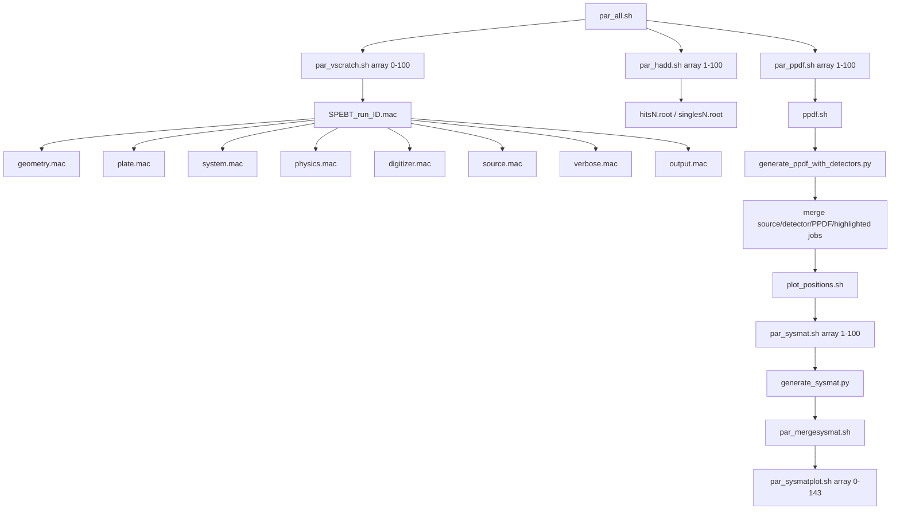

# Magic-Cube V1 Implementation Readiness Audit

Audit date: 2026-08-10  
Repository root: `/vscratch/grp-rutaoyao/Kirtiraj/Magic Cube/mcsim`  
Primary GATE-Macro directory: `/vscratch/grp-rutaoyao/Kirtiraj/Magic Cube/mcsim/GateParallel_NewConfiguration/GATE-Macro`

This is a read-only inspection. No existing project file was modified, no SLURM job was submitted, and no production GATE simulation was executed.

Status vocabulary used below: `READY`, `PRESENT BUT NEEDS MODIFICATION`, `MISSING`, `UNKNOWN / REQUIRES RUNTIME VALIDATION`, and `LEGACY / SHOULD NOT BE REUSED`.

## 1. Executive Summary

The repository is structurally complete enough to begin designing the Magic-Cube V1 geometry, but it is not ready to run the existing pipeline unchanged. The reusable foundation is real: the macros demonstrate boxes, nested volumes, linear repeaters, a cubic-array repeater, GAGG and Air materials, a cylindricalPET system hierarchy, attachCrystalSD commands, digitizers, a 140-keV gamma source, ROOT output, and a SLURM dependency chain.

The current implementation is nevertheless an old 144-element detector. It has eight GAGG-only `xlayer` families, a tungsten plate, an x-oriented source plane, old digitizer windows, hard-coded hierarchy IDs, per-detector normalization, and absolute paths for a previous user. There is no local K9 definition, no Magic-Cube geometry or detector/source map, no reconstruction implementation, no explicit task-specific seed handling, and no validated mapping from a future 2048-element GAGG hierarchy to canonical detector IDs.

The most immediate environmental blockers are that `Gate`, `root`, `hadd`, and `root-config` are not on the current PATH; the current shell does not have the project’s assumed modules loaded; `/user/tridevme` is not readable or executable by the current user; and `/vscratch/grp-rutaoyao/Tridev` is readable but not writable. A Python virtual environment does contain the packages needed for metadata work, but the scripts invoke the ambient `python` and require environment alignment.

**Final status: GO WITH MINOR PREREQUISITES.** Step 1 can begin as a controlled geometry/configuration design task. Before the first tiny GATE test, the execution environment and output path, K9 material, new geometry/system attachment, output schema, and detector-ID validation must be resolved.

## 2. Repository / Git State

| Item | Finding | Evidence |
|---|---|---|
| Working directory | `/vscratch/grp-rutaoyao/Kirtiraj/Magic Cube` | `pwd` |
| Repository root | `/vscratch/grp-rutaoyao/Kirtiraj/Magic Cube/mcsim` | `find` located `GateParallel_NewConfiguration/GATE-Macro`; `.git` is under `mcsim` |
| Primary folder | `/vscratch/grp-rutaoyao/Kirtiraj/Magic Cube/mcsim/GateParallel_NewConfiguration/GATE-Macro` | `find . -type d -path '*/GateParallel_NewConfiguration/GATE-Macro'` |
| Branch | `main` | `git -C .../mcsim branch --show-current` |
| HEAD/latest commit | `6ae5cdf8253b9643ea0f70ffcbbeafbd5d2357e6` | `git log -1 --format='%H'` |
| Latest commit | `Capture the current repository state for remote publication`, 2026-08-10 | `git log -1 --format='%h %ad %s'` |
| Pre-audit worktree | Clean; `git status --short` returned no entries | `git -C .../mcsim status --short` |
| Local additions requested by name | `run_full_pipeline.sh` and `check_full_run_outputs.sh` are absent | `test -e` checks; neither appears in the inventory |
| Existing audit-like document | `GATE_PARALLEL_END_TO_END_INSPECTION.md` exists and was treated as reference, not modified | inventory; file is 69,071 bytes |

The outer workspace also contains its own `.git`, but the implementation repository containing the requested folder is the nested `mcsim` repository. The recurring `logger: socket /dev/log: Operation not permitted` line came from the command environment and was not a repository change.

## 3. Complete Relevant File Inventory

All 62 pre-existing files listed below were tracked by the nested Git repository (`git ls-files -- GateParallel_NewConfiguration/GATE-Macro` returned 62). The source files were created with NFS timestamps on 2026-07-11; timestamps are shown to the nearest second because the nanosecond differences are not relevant to readiness. All are non-executable regular files except `submit_simulation.sh`.

For compactness, `mtime` is `2026-07-11 21:53:50` for the normal files, `2026-07-11 22:22:52` for the existing inspection document, and `tracked` is `yes` for every row. `refs` identifies the principal active caller; “none” means no active caller was found. “missing downstream” identifies a missing import or external dependency rather than a missing local file.

### Macros, database, documentation, notebooks, and logs

| Relative path | Type; bytes; mtime; exec | Role / status | refs; missing downstream |
|---|---|---|---|
| `GateMaterials.db` | database; 17,226; 21:53:50; no | Active material database; reusable entries but missing K9 | `SPEBT.mac`; none |
| `SPEBT.mac` | GATE macro; 651; 21:53:50; no | Active top-level macro; old configuration | launchers; all included macros exist |
| `geometry.mac` | GATE macro; 6,367; 21:53:50; no | Active old 144-element geometry; legacy for Magic-Cube | `SPEBT.mac`; no missing local refs |
| `plate.mac` | GATE macro; 1,124; 21:53:50; no | Active tungsten plate/hole geometry; should not be reused for V1 | `SPEBT.mac`; no missing local refs |
| `system.mac` | GATE macro; 1,017; 21:53:50; no | Active cylindricalPET hierarchy and SD attachment; old hierarchy | `SPEBT.mac`; no missing local refs |
| `physics.mac` | GATE macro; 2,614; 21:53:50; no | Active simple photoelectric configuration; old xlayer cuts | `SPEBT.mac`; no missing local refs |
| `digitizer.mac` | GATE macro; 7,523; 21:53:50; no | Active eight-family digitizer; old paths/window | `SPEBT.mac`; no missing local refs |
| `source.mac` | GATE macro; 1,835; 21:53:50; no | Active 140-keV plane source plus commented examples | `SPEBT.mac`; no missing local refs |
| `output.mac` | GATE macro; 958; 21:53:50; no | Active ROOT tree/hits/singles enablement; hard-coded old path | `SPEBT.mac`; output directory not writable |
| `verbose.mac` | GATE macro; 1,521; 21:53:50; no | Active verbosity settings | `SPEBT.mac`; none |
| `visual.mac` | GATE macro; 1,412; 21:53:50; no | Manual visualization support; not included by `SPEBT.mac` | none found; none |
| `sysmat_generation.ipynb` | notebook; 14,224,642; 21:53:50; no | Exploratory system-matrix work; large and not active shell dependency | manual; inspect selectively only |
| `.ipynb_checkpoints/Analytical PPDF-checkpoint.ipynb` | notebook; 72; 21:53:50; no | Notebook checkpoint; experimental | none; none |
| `.ipynb_checkpoints/MC PPDF-checkpoint.ipynb` | notebook; 137,507; 21:53:50; no | ROOT schema/detector filtering evidence; exploratory | manual; none |
| `.ipynb_checkpoints/Untitled-checkpoint.ipynb` | notebook; 15,478; 21:53:50; no | Exploratory checkpoint | none; none |
| `.ipynb_checkpoints/Untitled1-checkpoint.ipynb` | notebook; 588; 21:53:50; no | Exploratory checkpoint | none; none |
| `.ipynb_checkpoints/sysmat_generation-checkpoint.ipynb` | notebook; 3,199; 21:53:50; no | Exploratory checkpoint | none; none |
| `GATE_PARALLEL_END_TO_END_INSPECTION.md` | Markdown; 69,071; 22:22:52; no | Existing legacy audit/reference; not an implementation dependency | manual; none |
| `merge_detector.err`, `merge_detector.out` | log; 0 each; 21:53:50; no | Empty historical artifacts | none; none |
| `merge_highlighted.err`, `merge_highlighted.out` | log; 0 each; 21:53:50; no | Empty historical artifacts | none; none |
| `merge_ppdf.err`, `merge_ppdf.out` | log; 0 each; 21:53:50; no | Empty historical artifacts | none; none |
| `merge_source.err`, `merge_source.out` | log; 0 each; 21:53:50; no | Empty historical artifacts | none; none |
| `plot_positions.err`, `plot_positions.out` | log; 0 each; 21:53:50; no | Empty historical artifacts | none; none |
| `slurm-18152943.out` | log; 29; 21:53:50; no | Historical SLURM artifact | none; none |

### Shell orchestration and post-processing

| Relative path | Type; bytes; mtime; exec | Role / status | refs; missing downstream |
|---|---|---|---|
| `par_all.sh` | shell; 1,519; 21:53:50; no | Active dependency-chain submitter; reusable shape, old targets | manual entry; no local missing refs |
| `par_vscratch.sh` | SLURM shell; 1,726; 21:53:50; no | Active simulation array launcher; stale paths/modules | `par_all.sh`; Gate/module/output path runtime dependencies |
| `par_hadd.sh` | SLURM shell; 1,112; 21:53:50; no | Active ROOT merger; old task range/path | `par_all.sh`; `hadd` external |
| `par_ppdf.sh` | SLURM shell; 873; 21:53:50; no | Active PPDF array wrapper; old task range/path | `par_all.sh`; `ppdf.sh` exists |
| `ppdf.sh` | shell; 1,051; 21:53:50; no | Per-run PPDF wrapper; old output names/path | `par_ppdf.sh`; `generate_ppdf_with_detectors.py` exists |
| `merge_source_positions.sh` | SLURM shell; 444; 21:53:50; no | Source-position merge wrapper | `par_all.sh`; Python file exists |
| `merge_detector_positions.sh` | SLURM shell; 454; 21:53:50; no | Detector-position merge wrapper | `par_all.sh`; Python file exists |
| `merge_ppdf.sh` | SLURM shell; 414; 21:53:50; no | PPDF merge wrapper | `par_all.sh`; Python file exists |
| `merge_highlighted_detector.sh` | SLURM shell; 467; 21:53:50; no | Highlighted-detector merge wrapper | `par_all.sh`; Python file exists |
| `plot_positions.sh` | shell/SLURM; 777; 21:53:50; no | Position plot wrapper | `par_all.sh`; Python file exists |
| `par_sysmat.sh` | SLURM shell; 1,069; 21:53:50; no | Per-run system-matrix wrapper | `par_all.sh`; `sysmat.sh` exists |
| `sysmat.sh` | shell; 855; 21:53:50; no | Per-run system-matrix wrapper | `par_sysmat.sh`; Python file exists |
| `par_mergesysmat.sh` | SLURM shell with inline Python; 1,939; 21:53:50; no | Matrix concatenation; old path and schema | `par_all.sh`; pandas/parquet runtime |
| `par_sysmatplot.sh` | SLURM shell with inline Python; 4,259; 21:53:50; no | Old 144-detector plotting array | `par_all.sh`; pandas/numpy/matplotlib/runtime files |
| `par_sysmatplotbinned.sh` | SLURM shell with inline Python; 3,992; 21:53:50; no | Alternate old binned plotting path | manual; old 144 IDs |
| `par_sysmatplotconsist.sh` | SLURM shell with inline Python; 5,062; 21:53:50; no | Alternate consistency plotting path | manual; old paths/IDs |
| `par_sysmatbin.sh` | SLURM shell; 4,387; 21:53:50; no | Alternate matrix binning path | manual; old pipeline assumptions |
| `par_mergeplot.sh` | shell; 626; 21:53:50; no | Alternate CSV merge/plot path | manual; old absolute paths |
| `merge_and_plot.sh` | shell; 783; 21:53:50; no | Alternate merge/plot wrapper | manual; `merge_and_plot.py` exists |
| `par.sh` | SLURM shell; 1,600; 21:53:50; no | Older simulation launcher | manual; stale `/user/tridevme` path |
| `batch_par.sh` | SLURM shell; 2,524; 21:53:50; no | Older 0–9 array launcher | manual; stale path |
| `submit_simulation.sh` | SLURM shell; 1,499; 21:53:50; yes | Older 0–9 launcher | manual; stale path |
| `gate_parallel.slurm` | SLURM shell; 2,827; 21:53:50; no | Older 128-task/background strategy | manual; stale path and not `par_all.sh` |

### Python post-processing

| Relative path | Type; bytes; mtime; exec | Role / status | refs; missing downstream |
|---|---|---|---|
| `generate_ppdf_with_detectors.py` | Python; 4,365; 21:53:50; no | Active PPDF/highlight generator; old IDs and normalization | `ppdf.sh`; `uproot`, pandas, fastparquet |
| `generate_ppdf.py` | Python; 1,628; 21:53:50; no | Legacy single-detector CSV PPDF | not active; old hard-coded IDs |
| `generate_sysmat.py` | Python; 2,108; 21:53:50; no | Active old 144-detector matrix generator | `sysmat.sh`; `uproot`, pandas, parquet engine |
| `merge_source_positions.py` | Python; 810; 21:53:50; no | Concatenates source Parquet files | wrapper; pandas |
| `merge_detector_positions.py` | Python; 822; 21:53:50; no | Concatenates detector Parquet files | wrapper; pandas |
| `merge_ppdf.py` | Python; 705; 21:53:50; no | Concatenates PPDF Parquet files | wrapper; pandas |
| `merge_highlighted_detector.py` | Python; 801; 21:53:50; no | Concatenates highlighted detector files | wrapper; pandas |
| `plot_positions.py` | Python; 1,871; 21:53:50; no | Plots old source/detector positions | wrapper; pandas/matplotlib |
| `merge_and_plot.py` | Python; 2,370; 21:53:50; no | Alternate CSV merge/plot | `merge_and_plot.sh`; old paths |
| `get_all_ppdfs_mpi_optimized.py` | Python; 4,374; 21:53:50; no | Alternate MPI/HDF5 PPDF experiment | manual; missing local `local_functions`, missing `pymatcal` |

The user-specified names `run_full_pipeline.sh` and `check_full_run_outputs.sh` are not present. No other small active generator, detector-map, source-map, geometry-validator, or ROOT-schema-validator file was found.

## 4. Existing Execution Graph

The active submit graph is internally complete at the local shell/macro level, but it targets stale paths and old assumptions:



Evidence for the dependency submissions is `par_all.sh:3-27`; macro includes are `SPEBT.mac:2-29`; simulation macro generation/execution is `par_vscratch.sh:30-39`; ROOT merging is `par_hadd.sh:22-29`; and system-matrix merge/plot stages are `par_mergesysmat.sh:27-55` and `par_sysmatplot.sh:24-112`.

### Reference resolution

| Reference class | Result |
|---|---|
| `/control/execute` macro references | All eight local files named by `SPEBT.mac` exist: `geometry.mac`, `plate.mac`, `system.mac`, `physics.mac`, `digitizer.mac`, `source.mac`, `verbose.mac`, and `output.mac` (`SPEBT.mac:2-29`). |
| Local shell calls in the active graph | `par_vscratch.sh`, `par_hadd.sh`, `par_ppdf.sh`, all four merge wrappers, `plot_positions.sh`, `par_sysmat.sh`, and `par_mergesysmat.sh` exist (`par_all.sh:4-27`). |
| Python calls in the active graph | `generate_ppdf_with_detectors.py`, merge Python files, `plot_positions.py`, and `generate_sysmat.py` all exist. |
| External commands | `sbatch` and `srun` exist, but `Gate` and `hadd` are absent on the current PATH. |
| Stale absolute local references | `/user/tridevme/Tridev_SPEBT/...` and `/user/tridevme/parallel/SPEBT/...` are embedded in launchers and plotting paths (`par_vscratch.sh:22`, `par.sh:24`, `batch_par.sh:19`, `submit_simulation.sh:19`, `par_sysmatplot.sh:39`). |
| Missing imports outside the active graph | `get_all_ppdfs_mpi_optimized.py` imports `local_functions` and `pymatcal`; no local `local_functions.py` exists and `pymatcal` is not importable (`get_all_ppdfs_mpi_optimized.py:1-7`). |

There are no missing local references in the active macro/SLURM chain. That is not the same as operational completeness: the external executable/module, path, Python-engine, output-schema, and ID assumptions remain unresolved.

## 5. Missing File References

No active `/control/execute`, local `bash`, local `python`, `cp`, `hadd`, or `Gate` reference points to a missing file within `GATE-Macro`. The missing items are:

1. `run_full_pipeline.sh` and `check_full_run_outputs.sh`: absent local additions.
2. `local_functions.py`: imported by the non-active MPI experiment but absent.
3. `pymatcal`: external package imported by the non-active MPI experiment and not importable.
4. A K9 material database entry: absent from `GateMaterials.db` and no second material database was found.
5. Magic-Cube detector/source maps and a geometry generator/validator: absent.

`GateMaterials.db` is loaded by `SPEBT.mac:2`; all material names actually used by the old macros are local. The K9 gap is therefore a real V1 prerequisite, not merely a missing optional script.

## 6. Existing Magic-Cube-Related Material

Repository-wide text search for `Magic Cube`, `Magic-Cube`, `magiccube`, `magic_cube`, `K9`, `optical glass`, `67.2`, `32.0`, `2048`, `4.2`, `2.2`, `mosaic`, `checkerboard`, `FJ30035`, `Tc99m`, `112`, and `168` found no existing Magic-Cube implementation, K9 definition, detector coordinate table, or author-provided geometry in the code/macro/script files. The only meaningful old-design matches are GAGG in `geometry.mac`, `Tc99m` wording in `source.mac`, and unrelated numeric occurrences in old scripts/materials. The existing Markdown inspection document discusses the old design but is not an implementation.

The 14.2-MB `sysmat_generation.ipynb` and other notebooks were inventoried but not dumped or loaded wholesale under the large-file policy. Filename/text inspection found no Magic-Cube-named artifact. No adjacent project directory under the workspace’s repository root contains an obviously related Magic-Cube implementation.

**Classification: MISSING.** No local paper copy, Ref. 29 presentation, Hu/Yifan Hu macro bundle, CAD, K9 definition, author detector table, or Magic-Cube system-matrix data was found.

## 7. GATE / Geant4 / ROOT Environment

### Safe command evidence

| Command | Short result |
|---|---|
| `which Gate` / `which gate` | no executable found |
| `which root` / `which hadd` / `which root-config` | no executable found |
| `which gcc` | `/cvmfs/soft.ccr.buffalo.edu/versions/2023.01/compat/usr/bin/gcc` |
| `gcc --version` | GCC 10.4.0 (Gentoo 10.4.0 p5) |
| `which mpirun` / `which mpiexec` | no executable found |
| `which sbatch` / `which srun` | `/opt/software/slurm/bin/sbatch`, `/opt/software/slurm/bin/srun` |
| `sbatch --version`, `srun --version` | Slurm 25.11.7 |
| `module list` | only `ccrenv`, `gentoo/2023.01`, `ccrsoft/2023.01`; no GATE/Geant4/ROOT/OpenMPI module loaded |
| `python3 --version` | Python 3.10.8 |

The scripts assume GCC 11.2.0, Geant4 11.2.1 and data 11.2, OpenMPI 4.1.1, and GATE 9.4 (`par_vscratch.sh:16-19`). Other active wrappers repeat these loads, for example `par_hadd.sh:16-19`, `par_ppdf.sh:15-18`, and `par_sysmat.sh:15-18`. The current shell does not prove those modules are unavailable on the cluster; it proves only that the required stack is not loaded and no executable is on the current PATH.

| Component | Expected by scripts | Found now | Status |
|---|---|---|---|
| GATE | 9.4 | no `Gate` on PATH; module load only in scripts | UNKNOWN / REQUIRES RUNTIME VALIDATION |
| Geant4 | 11.2.1 plus data 11.2 | no executable/version on PATH; module load only in scripts | UNKNOWN / REQUIRES RUNTIME VALIDATION |
| ROOT/hadd | ROOT with `hadd` | neither command on PATH | UNKNOWN / REQUIRES RUNTIME VALIDATION |
| GCC | 11.2.0 | 10.4.0 current shell | PRESENT BUT NEEDS MODIFICATION |
| OpenMPI | 4.1.1 | no `mpirun` on PATH; not loaded | UNKNOWN / REQUIRES RUNTIME VALIDATION |
| SLURM | scheduler | Slurm 25.11.7 `sbatch`/`srun` | READY for the scheduler interface only |

No installation or update was attempted. A first tiny GATE test requires a confirmed module environment or equivalent executable paths, plus a writable output location.

## 8. Python Environment

The ambient `/cvmfs/.../python` and `/cvmfs/.../python3` are Python 3.10.8 and have common scientific packages but did not import `uproot`, `awkward`, `pyarrow`, or `fastparquet` in the audit probe. The explicit `/user/kmparmar/venv/bin/python` is also Python 3.10.8 and imported the active ROOT/parquet stack:

| Package | Required by | Ambient probe | `/user/kmparmar/venv/bin/python` | Status |
|---|---|---:|---:|---|
| numpy | plotting/alternate PPDF | 2.2.6 | 2.2.6 | READY in venv |
| pandas | active Python scripts/merge | 2.3.3 | 2.3.3 | READY in venv |
| uproot | `generate_ppdf*.py`, `generate_sysmat.py` | missing | 5.7.3 | PRESENT BUT NEEDS MODIFICATION to invocation |
| awkward | uproot ecosystem | missing | 2.9.0 | PRESENT BUT NEEDS MODIFICATION to invocation |
| matplotlib | plotting | 3.10.9 | 3.10.8 | READY in venv |
| pyarrow | Parquet alternative | missing | 24.0.0 | PRESENT BUT NEEDS MODIFICATION to invocation |
| fastparquet | active `.to_parquet(..., engine='fastparquet')` | missing | 2026.5.0 | PRESENT BUT NEEDS MODIFICATION to invocation |
| scipy | potential analysis | 1.15.3 | 1.15.3 | READY in venv |
| h5py | alternate MPI script | 3.16.0 | 3.15.1 | READY in venv |
| mpi4py | alternate MPI script | 4.1.1 | 4.1.1 | READY in venv, MPI runtime still unknown |
| pymatcal | alternate MPI script | missing | missing | MISSING for that legacy script |

The active shell wrappers call plain `python` (`par_mergesysmat.sh:30`, `par_sysmatplot.sh:30`) and the Python wrappers do not select `/user/kmparmar/venv/bin/python` (`ppdf.sh:21-25`, `sysmat.sh:17-22`). The Python environment is therefore not reproducibly wired into the pipeline. The active scripts consistently request `fastparquet` in `generate_ppdf_with_detectors.py:80-97`; no active script uses `pyarrow` explicitly, although pandas could use it if configured.

## 9. Materials Audit

| Material | Exact local definition | V1 use | Status |
|---|---|---|---|
| GAGG | `d=6.63 g/cm3`; Gd 3, Al 2, Ga 3, O 12 (`GateMaterials.db:121-125`) | Sensitive material positions | READY |
| Air | `d=1.29 mg/cm3`; N/O/Ar/C mass fractions 0.755268/0.231781/0.012827/0.000124 (`GateMaterials.db:155-159`) | Mother, gaps, source region | READY |
| Tungsten | `d=19.3 g/cm3`, elemental W (`GateMaterials.db:78-79`) | Old plate only | LEGACY / SHOULD NOT BE REUSED |
| K9 | No `K9` entry found | Required passive glass positions | MISSING |
| BK7 | No `BK7` entry found | Not required for V1 | MISSING, not a V1 blocker unless selected instead of K9 |
| Glass | `d=2.5 g/cm3`; Na/Ca/Si/O fractions 0.1020/0.0510/0.2480/0.5990 (`GateMaterials.db:161-165`) | Generic glass only; not proven K9 | PRESENT BUT NEEDS MODIFICATION; do not silently substitute |
| BaSO4 | No entry found | Explicitly ignored for V1 | MISSING but not a Step-1 blocker |

The GAGG definition is consistent with the requested approximate `Gd3Al2Ga3O12` and density 6.6–6.63 g/cm3. The generic `Glass` entry is not an exact K9 definition; no elemental K9 composition was invented. A second material database was not found in the repository. K9 must be supplied/approved before a material-complete first GATE geometry test.

## 10. Geometry Capability Audit

The old macros statically demonstrate the required *classes* of GATE construction:

| Capability | Evidence | Assessment |
|---|---|---|
| Box volumes | world, panel, module, block, zlayer and xlayer boxes (`geometry.mac:4-128`) | READY as a syntax pattern |
| Nested volume hierarchy | world → cylindricalPET → panel → module → block → zlayer → xlayer (`geometry.mac:9-128`) | READY as a syntax pattern |
| Linear repeaters | panel/module/block/zlayer and xlayer repeaters (`geometry.mac:145-187`) | READY as a syntax pattern |
| Cubic array repeater | tungsten plate hole array, X=1, Y=11, Z=10 (`plate.mac:18-23`) | READY as a syntax pattern |
| Many copies of one sensitive logical volume | seven 16-copy plus one 32-copy GAGG families (`geometry.mac:150-187`) | READY as a syntax pattern |
| Explicit 3-D x/y/z repeat vectors | hole cubic array has Y/Z vector; old detector uses linear y vectors only (`plate.mac:18-23`, `geometry.mac:165-187`) | PRESENT BUT NEEDS MODIFICATION |
| Alternating layers/checkerboard | no implementation found | MISSING |

The existing repeater vocabulary can plausibly construct 16×16×16 placements, and separate GAGG/K9 logical families can plausibly represent 2048/2048 material positions. It does not prove that a chosen nested repeater hierarchy will yield a stable, unambiguous canonical detector ID or that all four parity sub-lattices can be attached/indexed as intended. Those questions require a deliberately tiny GATE runtime test after the new macros exist.

The old dimensions and orientation are not reusable: xlayer elements are 3×3×3 mm GAGG (`geometry.mac:56-128`), old repeats use 6.72/3.36 mm vectors (`geometry.mac:165-187`), the panel is translated to x=137 mm (`geometry.mac:20-27`), and the old construction is not the requested center-at-origin z-depth convention. The tungsten plate is a separate active daughter (`plate.mac:1-30`) and must not enter V1.

## 11. System / Sensitive Detector Audit

The current system is `/gate/systems/cylindricalPET` with:

```text
cylindricalPET/rsector  -> panel
cylindricalPET/module   -> module
cylindricalPET/submodule -> block
cylindricalPET/crystal -> zlayer
xlayer1 ... xlayer8 -> attachCrystalSD
```

These attachments are shown in `system.mac:2-5` and `system.mac:18-25`. The `layer1...layer8/attach` commands are commented in `system.mac:7-14`, while the eight xlayer sensitive attachments are active. Thus the generic mechanism is demonstrated, but the correspondence between the `crystal` system level and the actual sensitive xlayer daughters is not proven by static inspection.

Generic/reusable: GATE’s `attachCrystalSD` pattern, a named hierarchy, and collection/digitizer attachment. Old-specific: `cylindricalPET`, panel/module/block/zlayer names, xlayer1–8 names, and downstream assumptions that `volumeID[2]`/`volumeID[6]` identify the detector.

For Magic-Cube, multiple GAGG families can likely use analogous attach commands, but whether a new box-world hierarchy can use this system as a useful indexing framework, or needs another system type/attachment arrangement, is **UNKNOWN / REQUIRES RUNTIME VALIDATION**. Do not infer detector IDs from the old files.

## 12. Digitizer Audit

Each `xlayer1` through `xlayer8` has an `adder`, `energyResolution`, `spatialResolution`, and `energyFraming` chain. The representative xlayer1 chain is `digitizer.mac:4-17`; the same structure repeats through xlayer8 at `digitizer.mac:19-122`.

Current values are 10% FWHM at 140 keV, 1.0 mm spatial FWHM, and a 120–160 keV energy window (`digitizer.mac:7-17`). The mechanism is sufficient to demonstrate energy summing, energy resolution, spatial resolution, and framing, but it is tied directly to old xlayer names. The target eventual 112–168 keV window and paper value of approximately 25.5% at 140 keV were not applied during this audit. The Magic-Cube digitizer branch needs new sensitive logical-volume paths and a deliberate later value decision.

**Status: PRESENT BUT NEEDS MODIFICATION.**

## 13. Physics Audit

The active physics is PhotoElectric with `StandardModel` (`physics.mac:5-6`). Compton is commented (`physics.mac:8-9`), Rayleigh scattering with `PenelopeModel` is commented (`physics.mac:11-12`), and electron ionisation, bremsstrahlung, annihilation, and multiple scattering are also commented (`physics.mac:14-25`). The process list is enabled/initialized at `physics.mac:27-28`.

Production cuts are hard-coded for `xlayer1` through `xlayer8`, with 1.0 cm gamma/electron/positron cuts (`physics.mac:34-64`). The file therefore demonstrates a simple photoelectric-only starting point and shows where Compton/Rayleigh could later be enabled, but the cuts and names are old-design-specific. Physics selection was not changed or decided during this audit.

**Status: PRESENT BUT NEEDS MODIFICATION.** A V1 tiny test can start from the demonstrated simple model only after the new sensitive names and material/geometry paths are defined; realistic physics is later work.

## 14. Source Audit

The active source is gamma, mono 140 keV, with an active plane rectangle: center `-187.5 0 0 mm`, rectangle half sizes 250 mm, and a restricted angular range (`source.mac:39-60`). The source is therefore not the intended centered isotropic 0.7-mm sphere/point source in the requested z convention.

Local commented examples show gamma/mono 140 keV, a cylindrical volume source, isotropic angular type, and source geometry controls (`source.mac:3-35`). No active or commented `GPS Point` literal, confined spherical source, source-map placeholder, or source-coordinate substitution mechanism was found. The local examples are enough to guide a future source macro, but configurable 2-mm source positions and finite 0.7-mm diameter require modification.

| Capability | Status |
|---|---|
| Gamma source | READY |
| 140 keV monoenergetic source | READY |
| Isotropic emission syntax | PRESENT BUT NEEDS MODIFICATION; active source has angular restrictions, commented example has `iso` |
| Point/finite sphere source | PRESENT BUT NEEDS MODIFICATION; no local GPS Point/sphere implementation |
| Source coordinate parameterization | PRESENT BUT NEEDS MODIFICATION; current coordinate is hard-coded |
| 2500-position source map | MISSING |

## 15. ROOT / Output Schema Audit

`output.mac` enables the ROOT tree, hits, and singles output (`output.mac:14-17`). The branch-name configuration lines for hits and singles are commented (`output.mac:19-23`), and the active singles output path is hard-coded to `/vscratch/grp-rutaoyao/Tridev/SPEBT_${SLURM_ARRAY_TASK_ID}.root` (`output.mac:15`). This output path is not writable by the current user.

The existing active Python scripts expect `tree;1`, hit branches `posX`, `posY`, `volumeID[2]`, `volumeID[6]`, `eventID`, and singles branches `sourcePosX`, `sourcePosY`, `sourcePosZ`, `eventID` (`generate_ppdf_with_detectors.py:9-13`, `generate_sysmat.py:9-15`).

### Existing ROOT evidence

Representative pre-existing files were inspected by metadata only:

- `/vscratch/grp-rutaoyao/Tridev/0_2dtest_0/SPEBT_1.Singles_xlayer1.root`, 9,131,070 bytes: tree `tree;1`, 317,729 entries. Branches include `runID`, `eventID`, `sourceID`, source position, global position, `rsectorID`, `moduleID`, `submoduleID`, `crystalID`, `layerID`, and `energy`.
- `/vscratch/grp-rutaoyao/Tridev/0_2dtest_0/SPEBT_1.hits_xlayer1.root`, 24,273,107 bytes: tree `tree;1`, 357,175 entries. Branches include `runID`, `eventID`, `sourceID`, `posX/posY/posZ`, `edep`, `volumeID[0]` through `volumeID[9]`, source position, named hierarchy IDs, and scattering metadata.

The metadata probe used `/user/kmparmar/venv/bin/python` and uproot, read tree keys/branch names, and did not load the files wholesale. The branch presence proves that run/event IDs, source coordinates, hit coordinates, deposited energy, and richer hierarchy information can be exposed by this existing workflow. It does **not** prove what the hierarchy indices mean for a new geometry.

| Output requirement | Assessment |
|---|---|
| runID/eventID | READY in existing ROOT evidence |
| source position | READY in existing ROOT evidence; source branches used by scripts |
| hit position/edep | READY in existing ROOT evidence |
| volume hierarchy/copy numbers | PRESENT BUT NEEDS MODIFICATION; rich branches exist, but mapping is unvalidated |
| canonical detector_id 0..2047 | MISSING; no detector map or validated mapping exists |
| raw/absolute response | PRESENT BUT NEEDS MODIFICATION; current scripts also create normalized values and do not define a stable absolute-count contract |

The old code’s use of only `volumeID[2]` and `volumeID[6]` is not safe for Magic-Cube without a small ID experiment. Use of `runID` in event matching is also required before merging independent runs.

## 16. Existing ROOT Data Audit

Representative ROOT files are present under the configured external output tree, including the two files above and additional xlayer1–xlayer8 hits/singles fragments. Their presence proves that historical GATE/ROOT artifacts exist. They are not in the Git repository and were not copied or processed. No full analysis was run; only tree names, entry counts, and branch names were inspected.

There are no ROOT, Parquet, CSV, NPY, HDF5, or similar data files in the tracked primary GATE-Macro tree itself. Existing external data is legacy xlayer data and cannot validate Magic-Cube IDs.

## 17. SLURM / Parallel Audit

The active chain uses:

- simulation array `0-100`, one task, four CPUs, 25,000 MB, 10 hours (`par_vscratch.sh:5-11`);
- `hadd`, PPDF, and system-matrix arrays `1-100` (`par_hadd.sh:5-11`, `par_ppdf.sh:4-10`, `par_sysmat.sh:4-10`);
- detector plotting array `0-143` (`par_sysmatplot.sh:5-11`), despite a contradictory comment saying 128 jobs;
- dependency chaining through `afterok` (`par_all.sh:4-27`).

The simulation/task-ID mismatch is material: task 0 is generated by the simulation array but downstream arrays start at 1. The existing pipeline therefore provides a **reusable SLURM pattern for source-position arrays**, but it is **PRESENT BUT NEEDS MODIFICATION** for approximately 2500 source locations and optional source×replicate indexing. No arrays were changed and no jobs were submitted.

Resource, module, working-directory, output-directory, and mail settings are hard-coded in the scripts. The principal active launcher uses `/user/tridevme/Tridev_SPEBT/GateParallel_NewConfiguration/GATE-Macro` and `/vscratch/grp-rutaoyao/Tridev` (`par_vscratch.sh:21-39`).

## 18. Random Seed Audit

The only explicit engine configuration found is `MersenneTwister` (`SPEBT.mac:15`). The scripts use `SLURM_ARRAY_TASK_ID` to form output/macro suffixes (`par_vscratch.sh:27-36`), but no `setEngineSeed`, `autoSeed`, per-task seed, replicate ID, or seed injection was found. There is no source-position/replicate seed contract.

| Requirement | Status | Evidence |
|---|---|---|
| Random engine | READY | `SPEBT.mac:15` |
| Task-specific explicit seed | MISSING | no seed command in macros/scripts |
| Seed injection through current macro-generation path | MISSING | launcher copies/substitutes only output macro references (`par_vscratch.sh:30-36`) |
| Per-source/replicate reproducibility | MISSING | no source/replicate key or seed map |

## 19. Path / Storage Audit

Important absolute paths include:

| Path | Evidence | Access result for current user | Assessment |
|---|---|---|---|
| `/user/tridevme/Tridev_SPEBT/GateParallel_NewConfiguration/GATE-Macro` | `par_vscratch.sh:22`, `par.sh:24` | exists, not readable, not executable, not writable | BLOCKING stale path |
| `/user/tridevme/parallel/SPEBT/GATE-Macro` | `batch_par.sh:19`, `submit_simulation.sh:19`, `gate_parallel.slurm:26` | parent `/user/tridevme` not readable/executable/writable | LEGACY / SHOULD NOT BE REUSED |
| `/vscratch/grp-rutaoyao/Tridev` | `par_vscratch.sh:23`, `output.mac:15` | exists, readable, executable, **not writable**; owner `nobody:nogroup`, mode `drwxr-sr-x` | BLOCKING current output target |
| `/user/kmparmar/venv` | Python probe | usable for imports; scripts do not select it | PRESENT BUT NEEDS MODIFICATION |
| repository path under `/vscratch/.../Kirtiraj/Magic Cube/mcsim` | audit cwd | readable/writable by current user | suitable development root |

`du -sh /vscratch/grp-rutaoyao/Tridev` reported approximately 364G of legacy content. `df -h` for the relevant filesystem reported about 9.1T total, 5.8T used, 3.4T available, 64% used. This is an obvious-capacity observation, not a production capacity guarantee. The current output location is still unusable for new writes by the current user and must not be silently reused.

The old username `tridevme` appears in workdir, output, mail, and plotting references (`par_vscratch.sh:14,22-23`, `par_hadd.sh:14,22`, `par_sysmatplot.sh:14,24,37-39`). This is a high-risk silent-corruption/path failure.

## 20. Hard-Coded Old-Configuration Assumptions

| Assumption / hit | Classification | Evidence |
|---|---|---|
| 144 detector loop | old detector-count assumption | `generate_sysmat.py:24-25`, `generate_ppdf_with_detectors.py:25-26` |
| `0-143` plotting array | old detector-count assumption | `par_sysmatplot.sh:5`, `par_sysmatplotbinned.sh:5`, `par_sysmatplotconsist.sh:5` |
| `xlayer1...xlayer8` names | old geometry/system/digitizer/physics assumption | `geometry.mac:56-128`, `system.mac:18-25`, `digitizer.mac:4-122`, `physics.mac:34-64` |
| `volumeID[2]`, `volumeID[6]` | old hierarchy/indexing assumption | `generate_ppdf_with_detectors.py:10-13,28-30`, `generate_sysmat.py:10-15,24-30`, `output.mac:19-20` |
| `selected_volumeID_6` | old plotting/system-matrix assumption | `generate_ppdf_with_detectors.py:25-48`, `plot_positions.py:10-15`, `par_sysmatplot.sh:92-93` |
| `MetalPlate`, `plate.mac`, tungsten | old collimator assumption; explicitly excluded from V1 | `SPEBT.mac:4`, `plate.mac:1-30`, `GateMaterials.db:78-79` |
| old source `-187.5` | old source assumption | `source.mac:50` |
| panel `137` | old geometry/coordinate assumption | `geometry.mac:25` |
| old repeat vectors `6.72`, `3.36` | old geometry/pitch assumption | `geometry.mac:165-187` |
| old 3-mm xlayer dimensions | old detector-element assumption | `geometry.mac:58-60`, `geometry.mac:68-70`, through `geometry.mac:123-125` |
| energy resolution `0.10` | old digitizer assumption | `digitizer.mac:7-9` and repeated through `digitizer.mac:112-114` |
| energy window `120-160` | old digitizer assumption | `digitizer.mac:15-17` and repeated through `digitizer.mac:120-122` |
| 15-second DAQ | old simulation/source workload assumption | `SPEBT.mac:19-20` |
| array `0-100` versus downstream `1-100` | old pipeline/task-ID assumption | `par_vscratch.sh:5`, `par_hadd.sh:5`, `par_ppdf.sh:4`, `par_sysmat.sh:4` |
| absolute `/user/tridevme` and `/vscratch/.../Tridev` | old path/storage assumption | `par_vscratch.sh:21-39`, `output.mac:15` |
| detector-by-detector normalization | old PPDF/matrix assumption, incompatible with raw absolute response target | `generate_sysmat.py:36-42`, `generate_ppdf_with_detectors.py:73-81` |
| matching on `eventID` only | old event-key assumption; collision risk after merging runs | `generate_sysmat.py:33-39`, `generate_ppdf_with_detectors.py:70-77` |
| exact float source grouping | old source-grid assumption | `generate_sysmat.py:36-39`, `generate_ppdf_with_detectors.py:73-77` |
| unrelated material values 112/120/127/128/160 | mostly material or resource literals; classify each use by context, not as Magic-Cube values | `GateMaterials.db:36-38,158`, `par_*: memory directives`, digitizer lines above |

The most dangerous assumptions are the ones that can produce plausible but wrong results without crashing: detector ID meaning, event matching without runID, detector-wise normalization, old source coordinates, and old absolute paths.

## 21. System-Matrix Pipeline Audit

### Active inputs and outputs

`generate_ppdf_with_detectors.py:9-13` and `generate_sysmat.py:9-15` read `tree;1` from merged hits/singles ROOT files and select position, hierarchy, event, and source-position fields. The PPDF generator loops over `volumeID[6]` values 0–143 to collect highlight positions (`generate_ppdf_with_detectors.py:25-48`), then matches source events to selected detector events and groups by `sourcePosX, sourcePosY` (`generate_ppdf_with_detectors.py:70-77`). It writes raw `count` and `normalized_count` plus source/detector/highlight Parquet files (`generate_ppdf_with_detectors.py:76-97`).

`generate_sysmat.py:24-42` loops detector IDs 0–143, filters `volumeID[2] == 0` and `volumeID[6] == detector_id`, matches on `eventID`, groups by source x/y, and computes `count / count.sum()`. It writes rows with `detector_id` and normalized counts to Parquet (`generate_sysmat.py:42-54`).

`par_mergesysmat.sh:30-55` finds `system_matrix_*.parquet`, concatenates them, and writes `combined_system_matrix.parquet`. `par_sysmatplot.sh:37-112` reads the combined matrix, filters a detector ID 0–143, re-bins source positions into 200×200 bins, normalizes the heatmap, overlays detector positions, and saves a PNG.

### Required Magic-Cube assessment

| Question | Finding |
|---|---|
| Retains raw counts? | The active PPDF script writes a raw `count` alongside `normalized_count` (`generate_ppdf_with_detectors.py:76-81`); the active system-matrix script writes only normalized `count / sum` (`generate_sysmat.py:36-42`). This is not a raw/absolute response contract. |
| Detector-by-detector normalization? | Yes, in both the PPDF output and system-matrix generator (`generate_ppdf_with_detectors.py:76-81`, `generate_sysmat.py:36-42`). |
| Uses eventID without runID? | Yes (`generate_ppdf_with_detectors.py:70-77`, `generate_sysmat.py:31-39`). Existing ROOT trees contain runID, so this is avoidable but currently unsafe. |
| Exact floating source grouping? | Yes, grouping uses exact `sourcePosX, sourcePosY` (`generate_ppdf_with_detectors.py:73-77`, `generate_sysmat.py:36-39`). |
| Assumes detector IDs 0–143? | Yes (`generate_ppdf_with_detectors.py:25-26`, `generate_sysmat.py:24-25`, `par_sysmatplot.sh:5,42`). |
| Preserves a 2048-element canonical map? | No map exists. The old code uses hierarchy assumptions and a selected volume field. |
| Matrix orientation | The scripts produce long rows keyed by detector ID and source x/y; no reconstruction module or explicit matrix orientation contract was found. |
| Merger | Structurally reusable concatenation, but must preserve source/replicate identity and the revised raw-count schema. |

**Classification: reusable structure but logic must change.** It should not be reused unchanged, and it is not a quantitative Magic-Cube system matrix until normalization, event keys, source indexing, detector mapping, and energy/direct-event policy are explicitly redesigned.

## 22. Reconstruction Availability

Search for `MLEM`, `OSEM`, reconstruction, CT1, sensitivity image, likelihood, and related terms found no active reconstruction implementation in the repository. The notebooks and old plotting code provide visualization/PPDF work, not a reconstruction engine. No matrix orientation, image dimensions, or reconstruction input format is therefore established.

**Status: MISSING.** Reconstruction is required later, not before defining geometry or performing the first tiny GATE geometry/output test.

## 23. Geometry Generator Availability

No existing Python or shell generator was found that creates the requested 4096 material placements, four checkerboard parity classes, detector map, or 2500 source coordinates. The current geometry is hand-written macro construction with repeated volumes (`geometry.mac:56-187`), and the current source is hand-written (`source.mac:39-62`).

**Status: MISSING.** A future `magiccube_config.*`, geometry generator, canonical detector map, and source map should be created before scaling to production. Hand-writing 4096 placements is not a safe long-term approach.

## 24. Validation Infrastructure

Available static/operational aids:

- `/gate/run/initialize` gives a built-in GATE initialize/geometry validation point (`SPEBT.mac:12`).
- `verbose.mac` and `visual.mac` provide manual diagnostic controls, although `visual.mac` is not included by the active top-level macro (`SPEBT.mac:23`, `visual.mac:1-52`).
- Existing ROOT branch evidence and plotting scripts can be adapted for output diagnostics (`output.mac:14-23`, `plot_positions.py:1-45`).
- Existing `GATE_PARALLEL_END_TO_END_INSPECTION.md` records known old-pipeline risks and is useful as reference.

Missing or unproven:

- no Magic-Cube geometry-count validator;
- no overlap/spacing/checkerboard-parity validator;
- no canonical detector-map validator;
- no small dedicated GATE test macro with deterministic source/seed;
- no ROOT schema validator;
- no `check_full_run_outputs.sh`;
- no automated source-grid/task-ID/replicate validator.

**Status: PRESENT BUT NEEDS MODIFICATION** for basic diagnostics; **MISSING** for Magic-Cube-specific validation.

## 25. Local Reference Materials

No local copy of Ref. 29, the named Magic-Cube paper/presentation, CAD, detector coordinate table, K9 definition, author-provided Hu/Yifan Hu code, or author system-matrix data was found in the repository or adjacent project directories. The requested detector dimensions and physics/source targets were supplied in the audit brief, not found as local implementation artifacts.

**Status: MISSING.** This is not a blocker for beginning a geometry scaffold, but it blocks paper-matched material/geometry confirmation and quantitative comparison.

## 26. Readiness Matrix

| Requirement | Status | Existing file/tool | Evidence | Modification needed later? | Blocking Step 1? | Notes |
|---|---|---|---|---|---|---|
| GATE executable/environment | UNKNOWN / REQUIRES RUNTIME VALIDATION | `par_vscratch.sh`; module system | no Gate on current PATH; expected `gate/9.4` load at `par_vscratch.sh:17-19` | Yes, environment selection | Yes before run | Do not assume current shell equals SLURM environment |
| Geant4 environment | UNKNOWN / REQUIRES RUNTIME VALIDATION | `par_vscratch.sh` | expected 11.2.1/data 11.2 at `par_vscratch.sh:17-19` | Yes, validate module stack | Yes before run | No current executable evidence |
| ROOT/hadd | UNKNOWN / REQUIRES RUNTIME VALIDATION | `par_hadd.sh` | `hadd` call at `par_hadd.sh:27-29`; absent current PATH | Yes, validate module stack | Yes before ROOT processing | Existing files prove historical use, not current availability |
| Python environment | PRESENT BUT NEEDS MODIFICATION | `/user/kmparmar/venv`; Python scripts | venv imports uproot/parquet; wrappers invoke plain `python` (`sysmat.sh:17-22`) | Yes, pin/use venv or equivalent | Yes before post-processing | Ambient Python is incomplete |
| GAGG material | READY | `GateMaterials.db` | `GateMaterials.db:121-125` | No for V1 definition | No | Matches approximate formula/density |
| K9 material | MISSING | none | no K9/BK7 entry; `GateMaterials.db:161-165` is generic Glass | Yes | Yes before material-complete test | Do not invent composition |
| Air material | READY | `GateMaterials.db` | `GateMaterials.db:155-159` | No | No | Available for mother/gaps/source region |
| Box-volume support | READY | `geometry.mac` | `geometry.mac:4-128` | New geometry still needed | No | Syntax pattern only |
| Repeater support | READY | `geometry.mac`, `plate.mac` | `geometry.mac:145-187`, `plate.mac:18-23` | New hierarchy needed | No | Static capability; runtime validate |
| 3-D lattice construction capability | PRESENT BUT NEEDS MODIFICATION | `plate.mac`, `geometry.mac` | cubic array at `plate.mac:18-23`; old linear rows at `geometry.mac:165-187` | Yes | No for design; yes before test | Checkerboard not present |
| Sensitive detector mechanism | UNKNOWN / REQUIRES RUNTIME VALIDATION | `system.mac` | `system.mac:2-25` | New names/attachment and ID test | Yes before first GATE run | Old cylindricalPET hierarchy is not proof |
| Digitizer mechanism | PRESENT BUT NEEDS MODIFICATION | `digitizer.mac` | `digitizer.mac:4-122` | New GAGG path, later values/window | No for geometry design; yes for detector test | Existing values are old |
| 140-keV gamma source mechanism | READY | `source.mac` | `source.mac:39-55` | Coordinate/shape later | No | Active mono gamma exists |
| finite point/sphere source mechanism | PRESENT BUT NEEDS MODIFICATION | `source.mac` | commented volume examples `source.mac:3-35` | Yes | Yes before source-matched run | No local GPS Point/sphere implementation |
| source-position parameterization | PRESENT BUT NEEDS MODIFICATION | `par_vscratch.sh`, `source.mac` | only task suffix substitution `par_vscratch.sh:30-36`; hard-coded source `source.mac:50` | Yes | No for geometry scaffold; yes for source test | Need source map/generator |
| ROOT output | PRESENT BUT NEEDS MODIFICATION | `output.mac`; existing ROOT | enablement `output.mac:14-17`; branch evidence from existing files | Yes, explicit schema/path | Yes before first test | Current path not writable |
| runID/eventID availability | READY in historical output | existing ROOT | metadata shows both; scripts read eventID `generate_sysmat.py:10-15` | RunID must enter keys | No | Use both for future matching |
| copy-number / detector hierarchy output | UNKNOWN / REQUIRES RUNTIME VALIDATION | existing ROOT; `system.mac` | `volumeID[0..9]` and named IDs observed; attachment semantics old | Yes, prove map | Yes before matrix use | Cannot infer Magic-Cube canonical IDs statically |
| energy-deposition output | READY in historical output | hits ROOT | `edep` branch observed; output enablement `output.mac:14-17` | Maybe explicit schema | No | Verify under new SD |
| SLURM array framework | PRESENT BUT NEEDS MODIFICATION | `par_all.sh`, `par_vscratch.sh` | dependencies `par_all.sh:4-27`, arrays above | Yes, 2500/source×replicate and task IDs | No for local design | Existing task range mismatch |
| seed framework | MISSING | `SPEBT.mac` only sets engine | `SPEBT.mac:15`; no seed command | Yes | Yes before reproducible test | Task suffix is not a seed |
| raw-count system-matrix generator | PRESENT BUT NEEDS MODIFICATION | `generate_sysmat.py` | normalizes at `generate_sysmat.py:36-42` | Yes | No for geometry; yes for matrix | Must retain absolute response |
| system-matrix merger | PRESENT BUT NEEDS MODIFICATION | `par_mergesysmat.sh` | concat/write `par_mergesysmat.sh:30-55` | Yes, new schema/keys/path | No for Step 1 | Structure is reusable |
| reconstruction implementation | MISSING | none | no MLEM/OSEM implementation found | Yes later | No | Required only after matrix |
| detector-map generator | MISSING | none | no map/generator found | Yes | No for initial macro design; yes for reliable test | Needed for 0..2047 canonical IDs |
| source-map generator | MISSING | none | no source map/generator found | Yes | No for initial geometry; yes for 2500 runs | Needed before production |
| geometry validation tooling | MISSING / basic built-in only | `SPEBT.mac`, `visual.mac` | initialize `SPEBT.mac:12`; no validator found | Yes | Yes before trusting test | Need count/spacing/parity/overlap checks |
| output validation tooling | MISSING / basic manual evidence only | ROOT metadata probe; no checker script | `output.mac:14-23` | Yes | Yes before matrix | `check_full_run_outputs.sh` absent |
| writable storage paths | PRESENT BUT NEEDS MODIFICATION | repo path; old Tridev path | old output `par_vscratch.sh:22-23`; access probes | Yes | Yes before run | old output is not writable |

## 27. Blockers

### A. Blockers before Step 1

Step 1 means beginning the controlled Magic-Cube V1 configuration design, not running production:

- No approved exact/approximate K9 material definition is present. The implementation can be designed around a named K9 material, but a material-complete test cannot proceed until its composition is supplied and approved.
- No writable, current-user-owned execution/output path is wired into the project. Existing `/user/tridevme` is inaccessible and `/vscratch/.../Tridev` is not writable.
- No Magic-Cube detector-ID convention/map exists. The parity convention and canonical mapping must be specified before output mapping is trusted.

These are minor prerequisites to design, but they are hard blockers to claiming a valid first run.

### B. Not blockers for Step 1, but required before the first GATE test

- Confirm the actual SLURM module stack/executable paths for GATE 9.4, Geant4 11.2.1/data, ROOT/hadd, GCC, and any required MPI runtime.
- Create/modify the Magic-Cube geometry hierarchy: centered 67.2×67.2×32 mm mother, 16×16×16 positions, 2-mm material elements, 2.2-mm lateral Air gaps, 8/8 GAGG/K9 depth parity, no plate.
- Define K9 and attach only GAGG as sensitive; validate 2048 GAGG copies and canonical IDs with a tiny test.
- Make output paths and branch configuration explicit; validate `runID`, `eventID`, source coordinates, edep, and copy/hierarchy fields.
- Replace old xlayer digitizer/system/production-cut names and add explicit deterministic seed handling.
- Align the Python environment used by wrappers with uproot and the selected Parquet engine.
- Run only a tiny, controlled GATE geometry/ROOT test after the above is in place.

### C. Required only later

- Source-map generation for 2-mm coarse 100×100 mm FOV and approximately 2500 points.
- Correct raw/absolute 2048-vector system-matrix generation and merge across source/replicate runs.
- Final 1-mm reconstruction grid and MLEM/OSEM implementation.
- Energy-window and resolution policy at the agreed stage.
- Realistic Compton/Rayleigh/direct-event policy decisions.
- Full 2500-position production resource plan and storage sizing.
- Quantitative sensitivity/reconstruction comparison with Ref. 29 and paper-level validation.

## 28. Proposed Future File Plan

This is a proposed plan only. No files below were created or modified by this audit.

| Current/future file | Future classification | Reason |
|---|---|---|
| `GateMaterials.db` | MODIFY LATER | Add approved K9 definition; preserve GAGG/Air; do not use generic Glass silently |
| `SPEBT.mac` | MODIFY LATER | New include set, run controls, output path contract, and seed/source configuration |
| `geometry.mac` | REPLACE LATER or split | Old xlayer/plate geometry should not be incrementally trusted for the new lattice |
| `plate.mac` | RETIRE FROM MAGIC-CUBE PATH | V1 explicitly has no tungsten plate/collimator |
| `system.mac` | MODIFY LATER | New GAGG SD attachment and validated hierarchy/indexing |
| `physics.mac` | MODIFY LATER | New sensitive-volume names/cuts; physics choice remains a later controlled decision |
| `digitizer.mac` | MODIFY LATER | New GAGG collection path; later resolution/window values |
| `source.mac` | REPLACE LATER or parameterize | New centered z convention and finite source/source-map mechanism |
| `output.mac` | MODIFY LATER | Current path and commented schema are unsafe; define required fields explicitly |
| `verbose.mac` | KEEP UNCHANGED initially | Generic diagnostic controls unless new macro needs changes |
| `visual.mac` | KEEP UNCHANGED initially | Useful manual diagnostic, not active by default |
| `par_all.sh` | MODIFY LATER | New dependency graph, arrays, paths, and no implicit task-ID mismatch |
| `par_vscratch.sh` | MODIFY LATER | Current-user paths, seed/source substitution, environment, and output naming |
| `par_hadd.sh` | MODIFY LATER | New paths and source/replicate task mapping |
| `par_ppdf.sh`, `ppdf.sh` | RETIRE FROM MAGIC-CUBE PATH or MODIFY LATER | Existing PPDF logic has old IDs and normalization |
| `par_sysmat.sh`, `sysmat.sh` | MODIFY LATER | New 2048 map, run-aware keys, raw response |
| `par_mergesysmat.sh` | MODIFY LATER | Preserve raw counts and source/replicate identity |
| `par_sysmatplot*.sh` | RETIRE FROM MAGIC-CUBE PATH initially | Old 144-detector display assumptions; rebuild after validated matrix schema |
| `generate_ppdf.py` | RETIRE FROM MAGIC-CUBE PATH | Legacy hard-coded detector 115/volume IDs (`generate_ppdf.py:14-38`) |
| `generate_ppdf_with_detectors.py` | REPLACE LATER | Active old detector-loop/highlight logic |
| `generate_sysmat.py` | REPLACE LATER | Normalization, event key, exact float grouping, and 144-loop assumptions |
| merge Python files | MODIFY LATER | Reuse concatenation only after new schemas/paths are defined |
| `plot_positions.py` | REPLACE LATER | Old selected ID and paths |
| `get_all_ppdfs_mpi_optimized.py` | RETIRE FROM MAGIC-CUBE PATH | Missing dependencies and unrelated experimental path |
| `merge_and_plot.py` and wrappers | RETIRE FROM MAGIC-CUBE PATH initially | Alternate legacy CSV pipeline |
| `batch_par.sh`, `submit_simulation.sh`, `par.sh`, `gate_parallel.slurm` | RETIRE FROM MAGIC-CUBE PATH | Stale paths/old execution models; retain as historical reference only |
| `magiccube_config.*` | NEW FILE EVENTUALLY NEEDED | Single source of approved dimensions, parity, material names, and indexing |
| `generate_magiccube_geometry.py` | NEW FILE EVENTUALLY NEEDED | Avoid hand-writing 4096 placements and keep parity/map deterministic |
| `detector_map.csv` or equivalent | NEW FILE EVENTUALLY NEEDED | Canonical GAGG ID 0–2047 → lateral/depth/copy hierarchy |
| `source_map.csv` or equivalent | NEW FILE EVENTUALLY NEEDED | Stable source ID → x/y/z for 2500-position runs |
| `validate_magiccube_geometry.py` | NEW FILE EVENTUALLY NEEDED | Count, dimensions, pitch/gap, parity, and coordinate checks |
| `validate_root_schema.py` | NEW FILE EVENTUALLY NEEDED | Branch, ID, run/source/event, and energy contract |
| `check_full_run_outputs.sh` | NEW FILE EVENTUALLY NEEDED | User-requested output sanity checks before production |
| small test macro/config | NEW FILE EVENTUALLY NEEDED | Low-stat deterministic geometry/ID/output test |
| reconstruction module | NEW FILE EVENTUALLY NEEDED | MLEM/OSEM and sensitivity handling, later stage |

## 29. Highest-Risk Items

1. **Wrong detector identity:** the old `volumeID[2]`/`volumeID[6]` assumptions and lack of a canonical 2048-element map could produce plausible but incorrect system matrices (`generate_sysmat.py:24-42`).
2. **Non-absolute response:** detector-wise normalization removes the raw sensitivity information required by the target matrix (`generate_sysmat.py:36-42`, `generate_ppdf_with_detectors.py:76-81`).
3. **Event collisions:** matching on `eventID` without `runID` is unsafe once multiple runs/replicates are merged (`generate_sysmat.py:31-39`); existing ROOT files show `runID` is available.
4. **Stale/inaccessible paths:** scripts target `/user/tridevme` and `/vscratch/grp-rutaoyao/Tridev`; current access probes found the former inaccessible and the latter not writable (`par_vscratch.sh:21-39`, `output.mac:15`).
5. **Unvalidated geometry/indexing hierarchy:** the old cylindricalPET system and xlayer SD attachment do not prove how a 16×16×16 checkerboard will be indexed, counted, or attached (`system.mac:2-25`, `geometry.mac:145-187`).

Other substantial risks are the missing K9 definition, task array mismatch (`0-100` versus `1-100`), unconfigured explicit seeds, and ambient Python/parquet-engine inconsistency.

## 30. Final GO / NO-GO Assessment

1. **Can we begin Step 1 of Magic-Cube implementation now?** Yes, as a controlled design/configuration task, provided the first activity is to establish the approved K9 input, geometry/indexing contract, and current writable paths. Do not run the old pipeline as evidence for the new design.
2. **Is the repository structurally complete enough?** Yes for a geometry scaffold and audit-guided reuse. No for an end-to-end Magic-Cube production workflow.
3. **What is missing before we can define geometry?** An approved K9 material definition, explicit checkerboard parity/indexing convention, a generator/map strategy, and a decision on the new GATE hierarchy/SD attachment.
4. **What is missing before the first tiny GATE run?** Confirmed GATE/Geant4 module environment, writable current paths, K9 entry, new geometry/system/physics/digitizer/source/output macros, explicit seed, and a small detector-ID/output validation procedure.
5. **What is missing before full 2500-position production?** Source map/generator, source×replicate task/seed contract, corrected ROOT merge/matrix logic, 2048 detector map, raw-count preservation, stable Python environment, resource/storage plan, and output validators.
6. **What is missing before quantitative comparison with Ref. 29?** Local/approved reference parameters, paper-matched source/detector/material/physics choices, final energy/resolution policy, validated reconstruction, sensitivity normalization/metrics, and controlled uncertainty checks.
7. **Are hidden old-configuration assumptions likely to silently corrupt results?** Yes: detector count/IDs, xlayer names, volume hierarchy fields, eventID-only matching, detector-wise normalization, hard-coded source/panel coordinates, old energy window/resolution, task-ID mismatch, and old paths.
8. **What are the five highest-risk items?** Wrong detector identity; loss of absolute response; event collisions; stale/non-writable paths; and unvalidated new hierarchy/indexing (listed in Section 29).

### Final status

**GO WITH MINOR PREREQUISITES**

This status means Step 1 design work may start, not that the old execution chain is ready for a Magic-Cube run. The existing project files remain unchanged by this audit.

## Audit evidence and scope notes

Safe commands used included `pwd`, `find`, `stat`, `git status`, `git log`, `git ls-files`, `which`, version/help checks, `module list`, Python import/version probes, `test -e/-r/-w/-x`, `df -h`, `du -sh`, targeted `rg`, and uproot metadata inspection of two existing ROOT files. No command installed software, submitted a job, launched GATE, wrote output data, or modified an existing project file.

The only new file created by this audit is this report.
